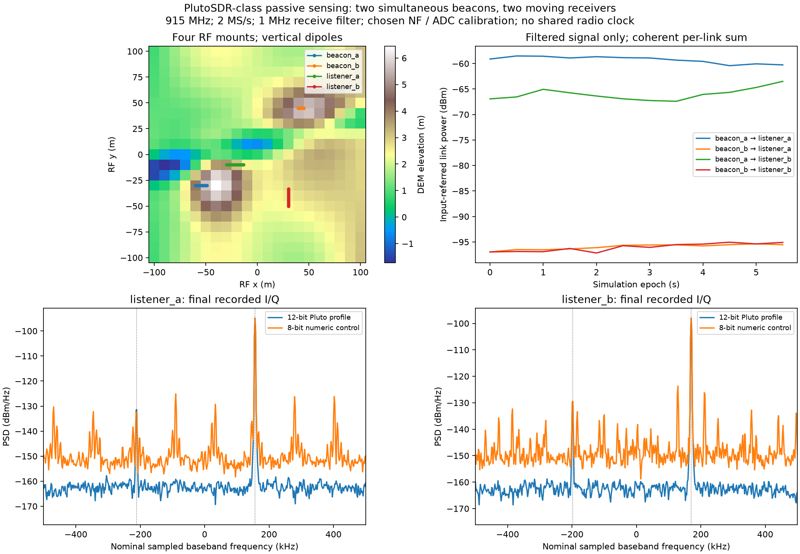
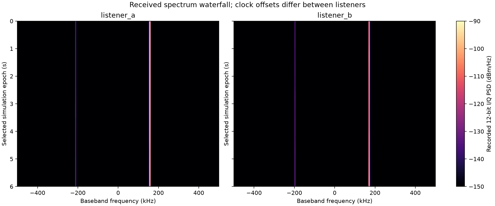

# A COTS SDR starter lab: four drones, two emitters, two listeners

The first SDR target is **Analog Devices ADALM-PLUTO (PlutoSDR)**. The new
example puts four radio mounts in the same RF terrain scene: two emit known
beacons and two listen passively. Each listener receives the coherent sum of
both emitters through actual Sionna environmental paths, then a sampled receive
chain produces 12-bit I/Q. The same radio hardware can later support
communications or carefully designed bistatic radar exercises.

This is a **specification-based model**, not a calibrated digital twin. It
enforces the published tuning, bandwidth and nominal ADC resolution. Noise
figure, receive gain/full scale, antenna installation and environmental
scattering remain explicit assumptions. Use the model to test algorithms,
identify hardware constraints and plan measurements; absolute purchase decisions
about detection range require calibration and a specified detector.
ADI likewise distinguishes a radio's capabilities from the range/rate of a
complete waveform, antenna and environment-dependent link [6](#ref6).



## Why start with PlutoSDR

ADI publishes **325 MHz–3.8 GHz** tuning, **20 MHz maximum instantaneous RF
bandwidth**, **12-bit ADC/DAC**, and one exposed TX plus one exposed RX, with
half- or full-duplex operation [1](#ref1), [2](#ref2). GNU Radio, libiio and Python tooling are
available. This matches a university RF laboratory much more closely than
assigning a synthetic 24 GHz radar waveform to arbitrary SDR hardware.

The detailed specifications distinguish internal converter rates from host
streaming: they list up to 61.44 MS/s internally, but USB streaming up to
**4 MS/s without dropped samples** [2](#ref2). Our default is **2 MS/s**, not a promise
that a host can continuously stream a 20 MHz channel. Hardware/host performance
still needs checking on the intended computer.

On **2026-10-03**, Nooelec listed ADALM-PLUTO at **US$349.95** [7](#ref7). Four radios
therefore have an indicative subtotal of **US$1,399.80**, before taxes, shipping,
antennas, cables, mounts, power, computers and drones. The page showed three
units left; four-unit availability is not established. A planning allowance of
roughly $400–$500 per RF payload can include modest antennas/cables, but only
the radio price above was retrieved as an actual currency-qualified quote.

| Candidate | Appropriate exercise | Main constraint | Repository status |
| --- | --- | --- | --- |
| PlutoSDR [1](#ref1), [2](#ref2) | Passive RF sensing, communications, separated TX/RX waveform experiments | 20 MHz RF bandwidth; host streaming and independent clock limits | New multi-emitter/multi-receiver example and sampled front end |
| RTL-SDR Blog [8](#ref8) | Lowest-cost receive-only experiments in supported bands | No transmitter; narrower bandwidth and lower converter resolution | Alternative to investigate; no RTL-specific calibrated model added |
| HackRF One [9](#ref9) | Broad tuning and transmit/receive experiments | Half duplex; nominal 8-bit I/Q | No HackRF model added; numeric 8-bit control is not a product comparison |
| Infineon Distance2GoL | Dedicated 24 GHz FMCW radar | Specialized RF/IF chain and antenna; not a general SDR | Existing [hardware radar profile](DISTANCE2GOL.md), currently point-target based |
| TI IWRL6432BOOST [10](#ref10) | Dedicated 57–64 GHz radar, multiple radar channels | Raw ADC capture needs a supported data path; TI documents DCA1000EVM | Hardware candidate, not yet a modeled profile |

Pluto cannot directly receive 24 GHz Distance2GoL or 60 GHz radar emissions.
Observing those emitters needs another RF frontend/downconverter or different
hardware. A simulator can share their scene geometry while evaluating separate
frequency bands; that does not extend a physical radio's tuning range.

## Reproduce the virtual experiment

From a bootstrapped checkout:

```bash
.venv/bin/python examples/pluto_esm_drones.py --output-dir recordings/pluto_esm
.venv/bin/python -m pytest tests/test_sdr.py -q
```

After the container workflow publishes this revision:

```bash
mkdir -p output
docker run --rm --network none --user "$(id -u):$(id -g)" \
  -v "$PWD/output:/work" ghcr.io/wa200508/airsim-rf:latest \
  python /opt/airsim-rf/examples/pluto_esm_drones.py --output-dir /work/pluto_esm
```

For a quick container smoke test, use `--epochs 2 --samples 1024
--samples-per-link 128`. That reduced sampling run checks execution, not the
default ground-scattering fidelity. The documented run uses **1,028 attempted
diffuse samples per independent TX/RX link**, covering both antenna patterns.
CUDA is selectable with `--backend cuda` only in an environment with the required
GPU runtime; the published CPU container does not establish GPU performance.

See [SDR runtime](SDR_RUNTIME.md) for measured update throughput, service latency, and the current hybrid CUDA bottleneck. A nominal update cadence does not demonstrate real-time execution.

The command saves:

* `pluto_esm_iq.npz`: raw input-referred analog I/Q, reconstructed ADC I/Q,
  signed ADC codes, a numeric 8-bit control, epochs and complete model metadata.
* `pluto_esm_report.json`: hardware constraints, assumptions, per-link powers,
  receiver noise budgets, retained path counts, clipping and clocks.
* `pluto_esm_overview.png` and `pluto_esm_waterfalls.png`: received-data plots.
* `listener_a.sigmf-data` / `.sigmf-meta` and corresponding listener B files:
  the final contiguous block, signed I/Q in little-endian int16 containers,
  with metadata identifying its 12-bit simulated conversion [11](#ref11).

The documented [raw recording](docs/figures/pluto_esm_iq.npz) and
[report](docs/figures/pluto_esm_report.json) are also checked in for inspection.

## Scenario and published constraints

| Parameter | Value | Evidence/status |
| --- | --- | --- |
| Physical target | ADALM-PLUTO | Purchasable hardware [1](#ref1), [7](#ref7) |
| Carrier | 915 MHz | Scenario choice within published tuning range |
| Beacons | Continuous complex tones at +150 kHz and −200 kHz | Controlled laboratory waveforms; no particular commercial emitter claimed |
| TX port powers | 0 dBm and −30 dBm | Chosen calibrated-port-power inputs; not a DAC/gain-setting prediction |
| Antennas | Ideal vertical half-wave dipoles at each mount | Approximately 2.15 dBi horizontal gain; not measured installed antennas |
| Receive channel bandwidth | 1 MHz | Choice within published 200 kHz–20 MHz range [2](#ref2) |
| Sample rate | 2 MS/s nominal | Choice below documented 4 MS/s USB streaming figure [2](#ref2) |
| Capture | 4,096 complex samples, about 2.048 ms | Short, frozen-channel block |
| ADC | Signed 12-bit I and Q, stored in int16 | Nominal resolution from [1](#ref1), [2](#ref2); ideal quantizer, not measured ENOB |
| Clock errors | TX +12/−8 ppm; RX +5/−10 ppm | Chosen values; ADI illustrates ±25 ppm initial Pluto accuracy [3](#ref3) |
| Channel update schedule | Nominal 200 Hz; every 100th epoch recorded | Twelve selected captures, 0–5.5 s; skipped ticks are not simulated |
| Surface | Existing 200 × 200 m hills/swale DEM, 800 triangles | Synthetic, uniform RF material |
| Paths | LoS plus at most one specular/diffuse surface interaction | General one-way propagation, no reciprocal radar-channel squaring |
| Proposed samples | 1,028 per link, four links | Attempts; misses and blocked samples are not retained paths |

All coordinates below are **RF x north, y west, z up**, in metres, matching
the [AirSim transform](README.md#attach-to-an-airsim-vehicle). Antennas are at
the given datum elevations, not at a fixed terrain-relative height.

| Mount | Role | Start x/y/z (m) | Velocity x/y/z (m/s) |
| --- | --- | --- | --- |
| beacon_a | Strong emitter | −60 / −30 / 12 | 2 / 0 / 0 |
| beacon_b | Weak emitter | 45 / 45 / 18 | −1 / 0 / 0 |
| listener_a | Passive receiver | −30 / −10 / 14 | 3 / 0 / 0 |
| listener_b | Passive receiver | 30 / −50 / 20 | 0 / 3 / 0 |

Every listener observes **both** beacons. The two-beacon powers are intentionally
unequal so students can investigate a weak signal in the presence of a stronger
one. The scenario is a passive spectrum-sensing exercise, not an emitter
classifier, direction finder, localization system or target-detection algorithm.

## How the radio model changes the RF data

`SDRNetworkReceiver` solves all scene links once at a capture epoch. Native
Sionna supplies complex path coefficients, absolute delays and endpoint Doppler.
Each delayed continuous waveform is weighted by its own port power and channel.
Those contributions sum **before** the listener's receive chain. There is one
thermal-noise realization per receiver, not one per transmitter.

Each radio has a chosen independent oscillator phase and reference error. The
same reference error affects its LO and sample rate. TX waveform timing/LO error
is applied before propagation; RX LO error is removed at the receive mixer. At
915 MHz, just **10 ppm of relative error means 9.15 kHz of frequency offset**,
much larger than typical drone-speed Doppler. A shared simulator clock does not
make inexpensive radios phase synchronized.

The receive-chain model adds white, input-referred thermal noise from `kTF`,
passes the signal/noise through a fourth-order Butterworth low-pass approximation,
and quantizes I and Q separately. Filter warm-up samples are discarded. Its
integrated noise budget uses the filter's calculated equivalent noise bandwidth,
approximately 1 MHz for the default configuration. The ideal ADC clips
independently at each component's signed rails.

The full-scale input setting is **−30 dBm** by default. This means an input
complex sinusoid at −30 dBm reaches full-scale component amplitude; it is a
chosen input-referred manual-gain calibration parameter, not a published Pluto
maximum input rating or a measured ADC-pin voltage. Changing receive gain in
real hardware changes that mapping and can also change noise figure.
ADI's receive documentation emphasizes that reception fidelity and sensitivity
depend on frequency and configuration [5](#ref5).

The default **10 dB noise figure is an assumption**. ADI's sensitivity discussion
quotes 2.5 dB at maximum receive gain [4](#ref4), but that is not a universal figure
for every frequency/gain setting. Our model deliberately exposes this setting;
it does not claim the chosen gain/full-scale/noise combination has been measured.

The same analog samples are also converted by an ideal 8-bit quantizer. This
isolates numerical resolution effects while holding propagation, noise and
clocks fixed. Its spurs/noise depend on waveform and input level. An 8-bit ADC
can still reveal a weak narrowband tone through integration; nominal bit count
alone is not a detection-range specification. This control is **not a calibrated
HackRF comparison**, and nominal ADC bits are not effective resolution.

The filter is currently a digital approximation for already-in-band inputs.
Emitter waveforms must declare frequency bounds; bounds including clock offsets
that exceed receiver Nyquist are rejected. This is not an analog out-of-band
blocker, compression, intermodulation or alias-rejection model. The current
approximation also requires receive bandwidth below output sample rate.

## What the tested example shows

At the final documented epoch, listener A receives approximately **−60.3 dBm**
from beacon A and **−95.5 dBm** from beacon B, before adding receiver noise.
Listener B receives approximately **−63.5 and −95.1 dBm**. The chosen filtered
thermal-noise budget is approximately **−104.0 dBm** per listener. Neither
12-bit capture clips. These are outputs of the stated model, not measurements
of Pluto hardware or calibrated rough-ground received powers.

The oscillator choices put the nominally sampled tones near:

| Receiver | Beacon A | Beacon B |
| --- | --- | --- |
| listener_a | +156.4 kHz | −211.9 kHz |
| listener_b | +170.1 kHz | −198.2 kHz |

These values exclude the small path-dependent Doppler. Welch spectra use
1,024-sample segments at 2 MS/s, so approximately 1.95 kHz bins do not resolve
the tens-of-hertz motion contributions. Differences between listeners are
principally chosen reference-clock offsets here.



The new tests independently check actual Sionna free-space link power against
Friis for two TX and two RX, coherent cancellation before quantization,
oscillator/sample-clock effects, one receiver-noise draw independent of emitter
count, filtered thermal noise power, clipping/quantization, rejection of invalid
hardware settings, and actual terrain paths. The AirSim bridge has a paused
network-snapshot/coordinate-transform check. None uses physical SDR measurements.

## Use the data in an SDR workflow

```python
import json
import numpy as np

with np.load("pluto_esm_iq.npz") as recording:
    iq = recording["adc_iq_volts"]     # complex64 [epoch, receiver, sample]
    codes = recording["adc_codes"]    # int16 [epoch, receiver, sample, I/Q]
    fs = float(recording["sample_rate_hz"])
    report = json.loads(str(recording["profile_json"]))
    final_listener_a = iq[-1, 0]
```

Input-referred `input_iq_volts` includes receiver noise after filtering.
Per-link powers in the report are separate signal-only diagnostics; their sum
need not equal instantaneous combined power because signals add coherently.
The reconstructed ADC volts use the chosen input calibration.

The SigMF files hold I/Q counts, with I then Q in signed little-endian int16.
They can feed compatible SDR analysis tools. The NPZ epochs are separated by
0.5 s; **do not concatenate them as a continuous stream or a coherent CPI**.
Only the final contiguous block is exported as SigMF. Recorded simulation times
and oscillator values are truth metadata, not evidence that purchased radios
supply synchronized timestamps.

The model accepts other continuous, unit-power callable waveforms through
`SDREmitter`, with explicitly declared frequency bounds. Signal processing is
kept separate from the channel/receive-chain machinery, as in the
[published RF implementations](ENVIRONMENTAL_RF_REFERENCES.md).

## Attach the radios to AirSim and the simulation plane

`AirSimSDRBridge` maps every scene radio to a ProjectAirSim robot handle, reads
all mounts at one paused world timestamp and updates position, orientation and
lever-arm velocity using the existing NED-to-RF transform:

```python
from airsim_rf.sdr_bridge import AirSimSDRBridge

# network is an SDRNetworkReceiver; world/robots are live ProjectAirSim handles.
bridge = AirSimSDRBridge(world, {
    "beacon_a": drone_a, "beacon_b": drone_b,
    "listener_a": drone_c, "listener_b": drone_d,
}, network, mounts_body_m={"listener_a": [0.1, 0, 0]})
# The caller pauses/steps the world at the desired capture epochs.
captures = bridge.capture(num_samples=4096)
```

This mapping is tested with simulated SDK handles. A live four-drone AirSim
flight has **not** been exercised here. Supply aligned RF scene meshes/materials;
the synthetic DEM is not automatically exported from Unreal or synchronized
with AirSim's visual terrain. The caller controls stepping and capture gaps.

The new receiver is a reusable one-way RF backend suitable for future
per-receiver GPU workers. The existing distributed worker/MEL demo still uses
the Distance2GoL point-target radar request schema; this change does not silently
convert that protocol into an ESM worker. Emission schedules, receiver settings,
multi-band routing, synchronization and waveform transport require a deliberate
protocol extension before claiming an operational general AMS-GRA RF plane.

## How this can inform a hardware purchase

Start with questions the model can answer under stated assumptions:

1. **Does the radio cover the band and bandwidth?** Pluto's 20 MHz limit gives
   approximately 7.5 m monostatic range resolution at full bandwidth, or 15 m
   total-path resolution for a separated TX/RX interpretation. It cannot deliver
   our 200 MHz terrain demo's approximately 0.75 m monostatic resolution. Our
   default 1 MHz passive receive channel is not a ranging configuration.
2. **Can the chosen processing handle unequal powers and clock offsets?**
   Vary `--weak-power-dbm`, `--full-scale-dbm` and `--noise-figure-db`; compare
   `--ideal-clocks`. Design synchronization and detection on received samples,
   then evaluate error/detection rates with a declared detector and thresholds.
   The present example plots spectra rather than implementing that detector.
3. **How sensitive is the result to the environment?** Compare `--propagation
   los`, `specular` and `diffuse` with the same hardware settings. Current diffuse
   samples are not persistent ground scatterers; revisit the
   [coherence and calibration limitations](GROUND_SCATTERING.md) before using
   clutter amplitude, slow-time spectra or route fading as purchase evidence.
4. **What must be measured on one borrowed or purchased unit?** Use a calibrated
   injected tone/attenuator to map ADC counts to RF input power versus gain and
   frequency; characterize noise/receive filtering, reference error, phase noise,
   TX port power and usable USB rate. Replace the exposed assumptions with those
   measurements before extrapolating quantitative performance.
5. **Which additional hardware is required for radar?** Pluto supports full
   duplex, but monostatic radar needs TX/RX isolation, leakage handling and a
   suitable waveform/clock arrangement. ADC clipping alone does not model RF
   saturation. Separated bistatic radios need synchronization and direct-path
   interference handling. A dedicated radar board may be the economical answer
   if range resolution and RF isolation dominate the requirement.

The ADC model omits AGC dynamics, RF compression/intermodulation, TX leakage,
DAC quantization/EVM, oscillator phase-noise spectra, LO spurs, I/Q imbalance,
DC offsets, acquisition jitter and USB drops. The antenna model omits feed loss,
airframe scattering and installed-pattern measurements. Terrain material and
diffuse statistics are synthetic. These omissions are recorded with the saved
data so an attractive plot cannot be mistaken for calibrated purchase evidence.

## References

Sources checked 2026-10-03. Prices and availability can change.

<a id="ref1"></a>
**[1] Analog Devices.** [ADALM-PLUTO evaluation board](https://www.analog.com/en/resources/evaluation-hardware-and-software/evaluation-boards-kits/adalm-pluto.html).
Published tuning, 20 MHz bandwidth, 12-bit ADC/DAC, duplex and software support.

<a id="ref2"></a>
**[2] Analog Devices.** [ADALM-PLUTO detailed specifications](https://wiki.analog.com/university/tools/pluto/devs/specs).
Tunable bandwidth, output-rate limits and USB streaming distinction.

<a id="ref3"></a>
**[3] Analog Devices.** [Phase Noise and Frequency Accuracy](https://wiki.analog.com/university/tools/pluto/users/phase_noise).
Independent frequency-error/drift discussion and ±25 ppm initial-accuracy example.

<a id="ref4"></a>
**[4] Analog Devices.** [Receiver Sensitivity](https://wiki.analog.com/university/tools/pluto/users/receiver_sensitivity).
Thermal-noise/noise-figure explanation; quoted 2.5 dB at maximum RX gain.

<a id="ref5"></a>
**[5] Analog Devices.** [ADALM-PLUTO Receive](https://wiki.analog.com/university/tools/pluto/users/receive).
Direct-conversion chain, gain/filtering and frequency-dependent performance.

<a id="ref6"></a>
**[6] Analog Devices.** [How far/fast?](https://wiki.analog.com/university/tools/pluto/users/far_fast).
Explains why radio coverage/rate depends on waveform, antennas and environment;
a radio alone does not specify a complete data link.

<a id="ref7"></a>
**[7] Nooelec.** [ADALM-Pluto retail listing](https://www.nooelec.com/store/adalm-pluto.html).
Retrieved US$349.95 and displayed inventory of three units on the review date.

<a id="ref8"></a>
**[8] RTL-SDR Blog.** [Buy RTL-SDR dongles](https://www.rtl-sdr.com/buy-rtl-sdr-dvb-t-dongles/).
Receive-only SDR alternative; no RTL hardware profile is implemented here.

<a id="ref9"></a>
**[9] Great Scott Gadgets.** [HackRF One](https://www.greatscottgadgets.com/hackrf/one/).
Published 1 MHz–6 GHz coverage, half duplex, up to 20 MS/s and 8-bit I/Q.

<a id="ref10"></a>
**[10] Texas Instruments.** [IWRL6432BOOST](https://www.ti.com/tool/IWRL6432BOOST).
57–64 GHz radar board; two TX, three RX; documented DCA1000 raw-ADC interface.

<a id="ref11"></a>
**[11] SigMF.** [Specification release v1.2.6](https://github.com/sigmf/SigMF/releases/tag/v1.2.6).
Signal-data/metadata interchange format; exported data uses `ci16_le`.
