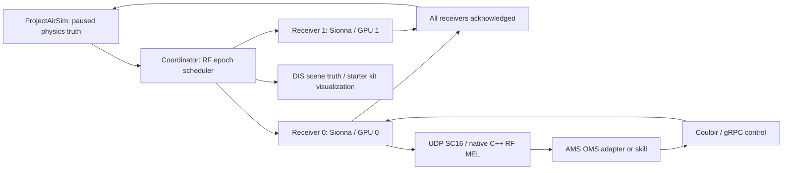

# Distributed AirSim RF simulation and AMS-GRA

AirSim is the physics/time authority. One persistent Sionna RT process computes
each receiver's monostatic FMCW echoes. Assign one NVIDIA GPU to each receiver;
workers can run on one host or separate LAN hosts. The coordinator itself needs
no RF GPU. AirSim rendering may need its own GPU in addition to those reserved
for RF.



## Run the container test and distributed example

```bash
docker pull ghcr.io/wa200508/airsim-rf:latest
docker run --rm --network none ghcr.io/wa200508/airsim-rf:latest
docker run --rm --network none ghcr.io/wa200508/airsim-rf:latest \
  python /opt/airsim-rf/examples/distributed_hello.py
```

The second command runs the test suite. The third starts **two separate CPU
Sionna worker processes**, runs concurrent network captures, and reports timing.
It uses analytic moving-drone truth, rather than a running AirSim server.
For separate containers with persistent recordings:

```bash
docker compose -f deploy/compose.cpu.yaml up --abort-on-container-exit --exit-code-from coordinator
docker compose -f deploy/compose.cpu.yaml down
```

Recordings remain in the Compose `recordings` volume. Do not add `down -v` unless
you want to delete them. GPU deployment and live AirSim were not executable in
the development environment; the CPU worker, scheduler, and native MEL path were
executed. These tests do not establish a GPU real-time performance claim.

## Two GPU receivers and live AirSim

Use Linux, NVIDIA Container Toolkit, a compatible NVIDIA driver, and two distinct
GPU IDs or UUIDs from `nvidia-smi -L`. Start AirSim separately with both configured
robots. Match the AirSim physics configuration to the requested 120 Hz; the
coordinator requests pause boundaries but cannot change Unreal's physics engine
settings. Worker CUDA startup fails if CUDA/OptiX is unavailable; there is no
automatic CPU fallback.

```bash
RX0_GPU=0 RX1_GPU=1 docker compose -f deploy/compose.gpu.yaml up -d
```

Edit `deploy/airsim.json`: robot names, AirSim scene filename, local scene/config
directory, receiver URLs, target positions/RCS, and the WGS-84 origin. The sample
origin is illustrative and **must match your AirSim scene's GeoPoint**; altitude
is ellipsoid height, not terrain height. The example scene filename is a
placeholder for your own two-drone scene. Static target positions and velocities
use AirSim NED meters; a target can instead have `robot` and `mount_body_m` to
follow live ground-truth motion. Receiver offsets use AirSim body coordinates.
The RF scene uses north/west/up. The existing bridge includes rotational
lever-arm velocity.

Run the coordinator on the AirSim host, mounting your existing simulator config:

```bash
docker volume create airsim-rf-live-recordings
docker run --rm --network host \
  -v "$PWD/deploy:/config:ro" \
  -v "/absolute/path/to/your/sim-config:/sim-config:ro" \
  -v airsim-rf-live-recordings:/work \
  ghcr.io/wa200508/airsim-rf:latest \
  airsim-rf-coordinator --config /config/airsim.json --duration-s 1 --output /work
```

With a source environment, the equivalent is
`.venv/bin/airsim-rf-coordinator --config deploy/airsim.json --duration-s 1`;
adjust `airsim.sim_config` to a local path. The coordinator connects to an
already-running AirSim server and loads the specified scene through the SDK.
It leaves the world paused on completion or failure. Existing vehicle flight
control remains external; this integration does not supply a flight controller.

On separate receiver machines, run this on each host, with a different ID/seed:

```bash
RECEIVER_ID=rx0 RECEIVER_GPU=0 RF_SEED=42 \
  docker compose -f deploy/compose.receiver.yaml up -d
```

Use that host's LAN address in the coordinator's `receivers[].url` at port 22100.
Each receiver has its own Couloir endpoint at port 21203. On the two-GPU single
host deployment, those endpoints are 21203 and 21205. Configure each consumer
with the appropriate `control_address` and a `data_host` address that **the worker
can reach**. MEL binds a dynamic UDP port on the consumer host. Network routing
must allow that traffic. DIS multicast must reach the starter-kit consumers
(configure a multicast interface or a unicast destination if needed).

The services use trusted simulation networks: HTTP and gRPC have no authentication
or TLS by default. Their addresses, scene version, and source pins belong in the
run configuration. Do not expose them directly on a public network.

## Timing and failure behavior

The profile retains its 5 ms PRI (200 chirps/s), 1.5 ms ramp, and 128 complex ADC
samples at 100 kS/s, starting 100 us into each ramp. A 120 Hz physics interval is
8.333 ms and can contain one or two RF epochs. The coordinator pauses AirSim at
the next requested physics boundary, reads the actual paused timestamp and every
robot's ground truth, and interpolates position/velocity linearly and orientation
with shortest-arc quaternion interpolation. It computes every due RF epoch
within that truth interval. This is interpolated physics truth; the RF model
still freezes delay within each chirp and uses the **narrowband Doppler
approximation**. AirSim pause overshoot is bracketed by actual timestamps.

No next physics interval is requested until all receivers return the requested
run UUID, sequence, and RF timestamp. Failures stop the run with physics paused;
the scheduler does not drop chirps or substitute wall-clock timestamps. Each
receiver accepts one capture at a time, contiguous sequences, increasing epochs,
and one coordinator lease. The last eight results are cached. An identical retry
returns the original noise realization and cannot re-send native UDP data; a
changed retry is rejected. After a coordinator crash, release its known run UUID
through `/v1/session` or restart the worker before starting another run.

Successful captures are written as `<run UUID>/<receiver ID>/<sequence>.npz`,
including raw analog complex IF volts, reconstructed ADC complex volts, ADC
codes, target range/Doppler/beat truth, receiver pose, target configuration, and
acquisition profile. `epochs.jsonl` records the RF epoch, physics truth bracket,
per-worker compute time, and complete-barrier latency. `run.json` summarizes the
run. The recordings are the reliable, timestamped signal-processing interface.

`--pace` provides best-effort wall-clock pacing; a slow receiver slows simulation.
It is not a 120 Hz hard-real-time guarantee. Benchmark on the intended GPU,
receiver count, and RF scene. A CPU development run with two receiver processes,
21 chirps per receiver and 12 physics intervals took 0.382 s for 0.1 simulated
seconds; median/p95 barrier times were 16.15/22.07 ms. This small free-space scene
already misses the 5 ms RF budget on that CPU, and says nothing definitive about
GPU throughput or dense multipath scenes. Initial JIT compilation/startup should
be measured separately from sustained captures.

## Exact starter-kit integration boundary

The checked starter kit is [Open Arsenal AMS-GRA hello-world](https://github.com/open-arsenal/ams-gra-hello-world-sk), root commit
`994ea81de70b20a195297b208b7fe480631471c1`. Its Squall RF runtime exposes gRPC
control through Couloir and sends **bare little-endian signed interleaved
16-bit I/Q over UDP**. We implement its actual `SquallRfControl` protobuf service:
status, destination registration/removal, fixed-profile tuning validation, and
operating-mode commands. The existing native C++ MEL is the AMS-facing API.
`deploy/ams-mel-rx0.json` is a consumer profile. Make a separate profile/client ID
for each receiver. Tuning to a different carrier, ADC rate, gain/AGC, or sweep is
explicitly rejected.

The optional `deploy/compose.ams-overlay.yaml` replaces Squall RF with one GPU
worker and keeps the kit's native RF OMS adapter and Couloir. It disables the
Supercell/JSBSim simulator and the unrelated optical/FM demo services by profile.
After installing the starter kit with its own installer:

```bash
export AIRSIM_RF_DEPLOY="$PWD/deploy"
export AMS_STARTER=/absolute/path/to/the/starter-kit/getting-started
RX0_GPU=0 docker compose --project-directory "$AMS_STARTER" \
  -f "$AMS_STARTER/supercell/compose.yaml" \
  -f "$AMS_STARTER/graupel/compose.yaml" \
  -f "$AMS_STARTER/worldview/compose.yaml" \
  -f "$AMS_STARTER/sleet/compose.yaml" \
  -f "$AMS_STARTER/ir-search-and-track/compose.yaml" \
  -f "$AMS_STARTER/rf-fm-demod/compose.yaml" \
  -f "$AMS_STARTER/squall/compose.yaml" \
  -f "$AIRSIM_RF_DEPLOY/compose.ams-overlay.yaml" \
  up -d sleet graupel cesiumjs-client squall-rf couloir squall-rf-oms-adapter
```

For this one-receiver overlay, remove `rx1` from the AirSim coordinator config.
Do not also start `compose.gpu.yaml` on the same host: its ports would collide.
For more receivers, use the standalone receiver deployment with distinct native
MEL profiles and OMS identities, rather than routing multiple receivers through
the same service prefix on one Couloir listener. Component manifests are merged
directly because the kit's top-level `include` plus service overrides conflicts
under Docker Compose 2.40.3. Set Worldview's simulation-center environment values
to your scene origin. The merged Compose configuration was validated; integration
with the full running kit has not been run here. The control and data boundary has.

AirSim body truth is published as DIS v7 EntityState PDUs, using WGS-84 ECEF
position/velocity/orientation, explicit `(site, application, entity)` IDs, and
fixed-orientation/world-velocity dead reckoning. DIS time maps simulation elapsed
time onto configured `epoch_unix_ns`. DIS identifies time within the hour; it
does not carry the complete nanosecond RF epoch. Stop Supercell before using
AirSim truth to avoid duplicate entities/competing simulation authorities.

**Current scope:** this is the RF MEL backend and DIS scene-truth integration.
It does not implement Supercell's platform UCI PositionReport, NavigationReport,
route planning, full simulation lifecycle/C2, optical sensors, or conformance
certification. Full ownship UCI reporting requires an additional platform adapter.
The stock FM-demodulation skill is not a radar processor. Its design-time VADB
also advertises 915 MHz/1 MS/s example capabilities, which must be replaced with
the radar's capabilities before using design-time discovery for this profile.
Runtime MEL capability queries use our 24.125 GHz/100 kS/s status.

Native MEL UDP has no run/sequence/timestamp header; its current callback creates
empty `ProductRxMetadata`. We preserve exact timing in HTTP/NPZ rather than insert
a header that would break that MEL. Each datagram is one 128-sample chirp window,
with gaps between windows, not a continuous 100 kS/s stream. SC16 conversion uses
a fixed `3.3 / (2*32767)` volts/count scale; it does not normalize every frame.
UDP delivery is best effort and can happen before the full receiver barrier
finishes. It is not an atomic, reliable cross-receiver output commit. Use the
recorded channel for timestamp-sensitive DSP and reproducibility.

## What propagation is exercised

Distribution does not add multipath or land-cover modeling. Each worker runs the
existing Distance2GoL-inspired point-target radar: Sionna direct-path visibility
and complex one-way transfer, reciprocal point-RCS echo construction, directional
antenna gain, dechirping, approximate IF filter/gain/noise and ADC quantization.
The path solver still uses `max_depth=0`. An optional aligned RF mesh can block
line of sight; reflected/clutter paths are not synthesized. No land-use/material
database or wideband Doppler model is introduced. See [DISTANCE2GOL.md](DISTANCE2GOL.md).
Custom RF scene assets must be identical on all workers, with a new explicit
`--scene-id`; the coordinator rejects differing scene versions. This is an
operator-supplied version identity, not automatic asset hashing.

## Reproduce the native MEL interoperability check

`tests/native/ams_mel_probe.cc` calls the public C++ MEL factories, commands
Operate, requests a virtual aperture and a 24.125 GHz RX job, creates a
ComplexINT16 endpoint, and verifies a callback. `scripts/verify_ams_mel.py` starts
the actual Couloir binary and our CPU worker, then checks all 128 callback samples
against the returned ADC volts. It was run successfully with the pinned container
digests in `sources.json`.

To repeat it, obtain the pinned interface headers (RF MEL, common MEL, AMS VITA,
AMS math), a C++20 compiler and Boost headers, extract `libsquall_rf_mel.so` from
the pinned OMS RF adapter image and `/usr/local/bin/couloir` from its pinned image,
and compile:

```bash
g++ -std=c++20 -pthread \
  -I"$RF_MEL/include" -I"$COMMON_MEL/include" -I"$AMS_VITA/include" -I"$AMS_MATH/include" \
  tests/native/ams_mel_probe.cc -L"$MEL_LIBRARY_DIR" -lsquall_rf_mel \
  -Wl,-rpath,"$MEL_LIBRARY_DIR" -o /tmp/ams_mel_probe
.venv/bin/python scripts/verify_ams_mel.py \
  --probe /tmp/ams_mel_probe --couloir /absolute/path/to/couloir
```

The native probe is optional and needs those external SDK artifacts. The default
container test suite covers the same wire contract and control behavior without
bundling the native SDK or requiring network access.
