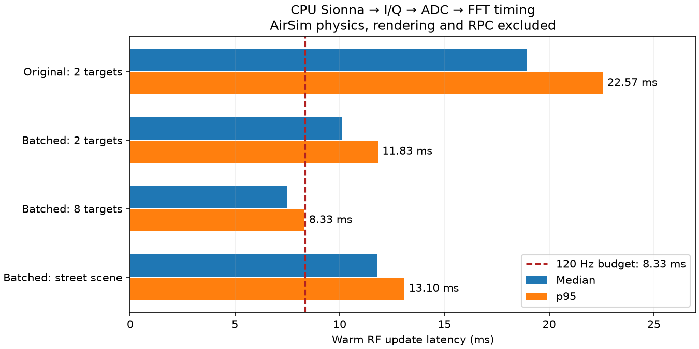

# RF timing versus a 120 Hz simulation

**Runtime context (2026-10-05):** Historical small point-target radar/chirp measurements, not continuous multi-emitter I/Q or full environmental multipath. See [current runtime and wall-clock costs](RUNTIME_STATUS.md) for comparable measurements, hardware, exclusions and ten-minute estimates.

The current accepted assumptions and updated results are in
[PER_PULSE_RUNTIME.md](PER_PULSE_RUNTIME.md): one channel epoch per pulse and
at most one scene interaction, with compact coefficients and analytic Doppler.

For the broader AMS-GRA plane (100 independent transmitters, 10 receivers and
moving-platform multipath), see [NETWORK_RUNTIME.md](NETWORK_RUNTIME.md).
It audits current limitations and separates tracing, wideband I/Q synthesis,
transport and hardware sizing using new multi-transmitter measurements.
The measurements below remain specific to the monostatic radar prototype.

A 120 Hz simulation tick has **8.333 ms** available for all synchronous work.
On this machine, the current Sionna-based RF adapter does **not reliably fit**
that deadline even before physics, rendering, RPC or data publication are added.
The results are CPU measurements, not predictions for your home GPU.

The original two-target implementation solved each target separately. Targets
are now batched into one Sionna `PathSolver` call, with persistent receiver
objects and cached noise-filter coefficients. This preserves echo phase and
target mapping; a new test compares a batched signal to the sum of individual
returns, including targets excluded by beam direction or zero RCS.



## Measured results

Run on 2026-10-02 with Python 3.12.14, Sionna RT 2.2.0, and Mitsuba's
`llvm_ad_mono_polarized` backend. The VM exposes three AMD EPYC 9V74 logical
CPUs, with a cgroup quota of two CPU cores and an 8 GiB memory limit. No GPU
was available. Cloud host contention and JIT/cache state affect the numbers.

| Workload | Samples | Median | p95 | Deadline misses |
| --- | ---: | ---: | ---: | ---: |
| Original, 2 targets, empty scene, one chirp + FFT | 100 | 18.92 ms | 22.57 ms | 100/100 at 8.33 ms |
| Batched, 2 targets, empty scene, short run | 200 | 9.44 ms | 10.31 ms | 110/200 at 8.33 ms |
| Batched, 2 targets, empty scene, longer run | 1000 | 10.11 ms | 11.83 ms | 838/1000 at 8.33 ms |
| Batched, 8 targets, empty scene | 200 | 7.51 ms | 8.33 ms | 10/200 at 8.33 ms |
| Batched, 2 targets, street scene (5 objects) | 200 | 11.78 ms | 13.10 ms | 200/200 at 8.33 ms |
| Batched, 2 targets, complete 16-chirp frame | 30 | 162.85 ms | 177.51 ms | 30/30 at 80 ms |

The 8-target run happened to be faster than the 2-target runs in this cloud
environment; do not infer a monotonic scaling curve from these separate runs.
The longer 2-target measurement was added to characterize timing variability.
Its worst sample was 75.14 ms, while p99 was 13.19 ms. Stored JSON files in
`benchmarks/results/` retain the full distributions and exact command arguments.

The street case uses Sionna's built-in `simple_street_canyon`; rays test geometry
and may be obstructed. It is not an aligned AirSim scene. All solves use
`max_depth=0` (direct paths/blocked paths), so these timings do not characterize
specular multipath, diffuse scattering, diffraction or moving mesh updates.

Each measured update materializes NumPy path coefficients, generates the FMCW
IF signal, applies target RCS and antenna response, adds colored thermal noise,
and quantizes both ADC channels. `--fft` includes range FFT processing. The
benchmark moves the radar and preserves phase between updates. Returning NumPy
data synchronizes Sionna/Dr.Jit evaluation; the timing is not just GPU/CPU work
submission latency.

AirSim transport, native physics, Unreal rendering, mesh export, background
sensor workloads and NPZ writing are excluded. The benchmark therefore tests
the isolated RF workload, not a live integrated 120 Hz simulation.

Imports took approximately 1.2–1.3 s. First-update timing varied from roughly
15–44 ms for empty scenes and was about 541 ms for the street scene. Initialize
and warm the RF pipeline before measuring steady-state deadlines.

## Physics rate, chirp rate and RF refresh rate

The hardware profile's chosen PRI is 5 ms: **200 chirps/s**, while physics at
120 Hz advances about once every 8.33 ms. A 16-chirp RF frame spans 80 ms and
arrives at 12.5 frames/s if chirps are contiguous. These are separate rates.
Simply generating one chirp per physics tick changes the chirp schedule and
slow-time Doppler properties. Synthesizing a whole frame in every 120 Hz tick
would also represent the wrong sampling schedule.

The current CPU implementation cannot sustain the selected 200-chirp/s
schedule when re-solving Sionna paths for every chirp: the measured full frame
took about 164 ms for an 80 ms simulated interval. Offline steppable simulation
can still preserve timestamps and physical sampling while running slower than
wall time.

For real-time operation, the next performance step is to decouple the 120 Hz
physics clock, RF path refresh, and chirp synthesis. For slowly changing geometry,
an RF worker could refresh paths at a lower rate and evolve their phase/Doppler
between refreshes, while physics publishes timestamped states and the worker
buffers chirps. Occlusion/material/moving-object changes would need invalidation
and interpolation policy. This cached-channel worker is a proposed next step;
the published implementation performs a fresh solve on every chirp.

A GPU or more CPU capacity may improve throughput, but small solves can remain
sensitive to launch and Python overhead. Run the included benchmark on the
actual home system and aligned scene, then include physics/render/RPC costs
before choosing a synchronous RF deadline.

## Reproduce the measurements

After bootstrap, from the `airsim-rf` repository root:

```bash
.venv/bin/python benchmarks/benchmark_rf.py --backend cpu --targets 2 --fft --iterations 1000 --warmup 100 --output benchmark_home_cpu.json
.venv/bin/python benchmarks/benchmark_rf.py --backend cuda --targets 2 --fft --iterations 1000 --output benchmark_home_gpu.json
.venv/bin/python benchmarks/benchmark_rf.py --backend cuda --rf-scene builtin:simple_street_canyon --targets 2 --fft --output benchmark_home_street.json
.venv/bin/python benchmarks/benchmark_rf.py --targets 2 --chirps 16 --update-hz 12.5 --iterations 30 --warmup 5 --fft --output benchmark_home_frame.json
```

The first two commands evaluate an 8.33 ms budget. The last evaluates an 80 ms
frame budget. Each output reports import, setup, first-update latency, median,
p95, p99, maximum, deadline misses, and raw latency samples.
