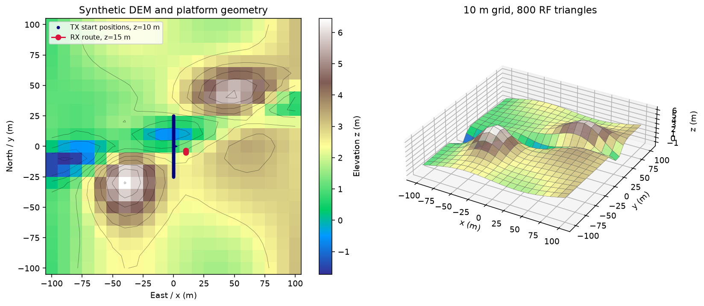
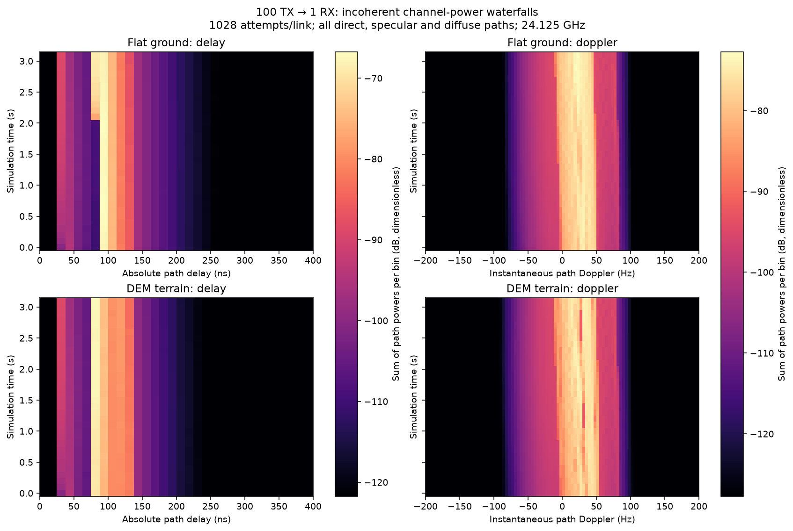
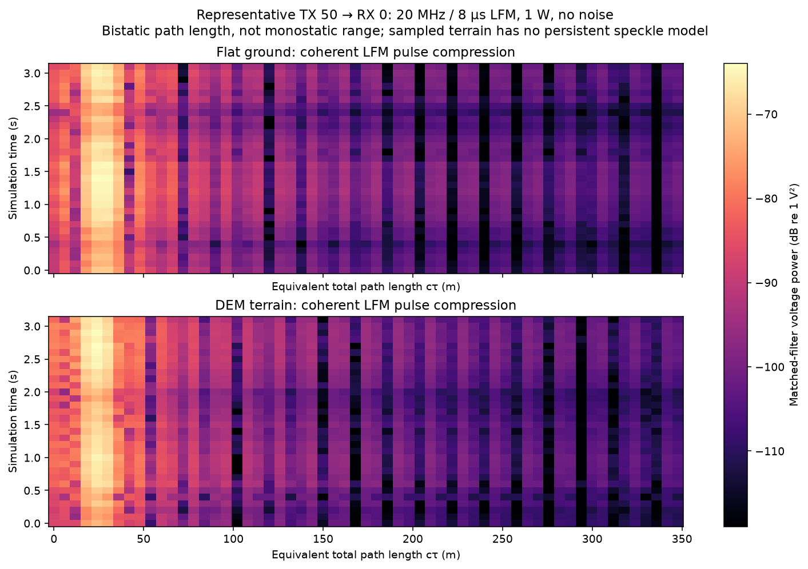
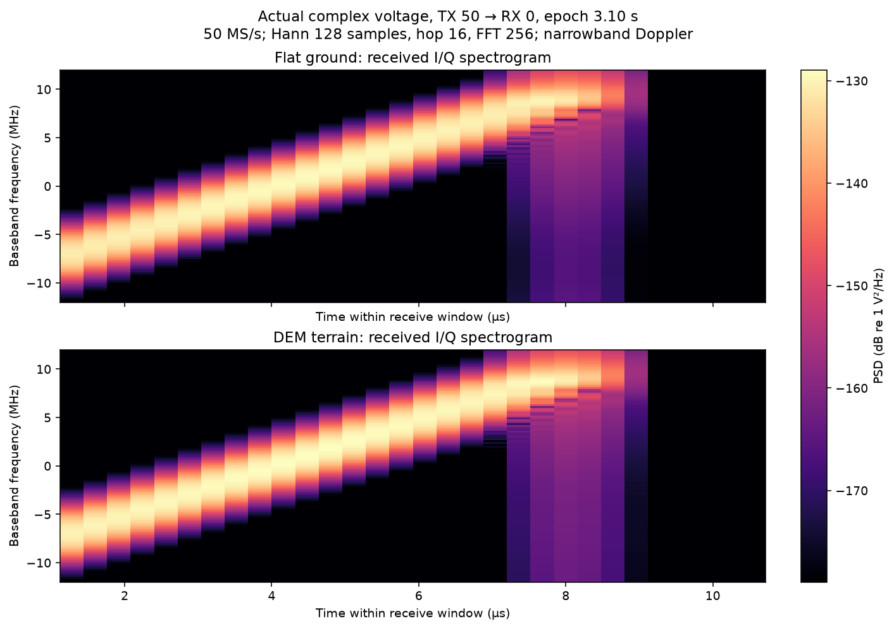

# Flat ground and DEM terrain: tested RF scenarios

**Timing scope:** Mixed scope or architecture/reference document; each workload/table retains its stated timed operation. [Common measurement definitions](TIMING_CONVENTIONS.md) apply to units, statistics, cache state, ratios and comparisons. Historical measurements and estimates are not current fleet-update qualification.


**Runtime context (2026-10-05):** Offline selected epochs and waveform plots demonstrate terrain effects, not a continuously advancing 120 Hz end-to-end flight. See [current runtime and wall-clock costs](RUNTIME_STATUS.md) for comparable measurements, hardware, exclusions and ten-minute estimates.

For a clear view of individual terrain features in I/Q, see the
[focused beam scan and bandwidth comparison](TERRAIN_SIGNATURE.md). The
aggregate scenario below tests many links; it is not a terrain imaging scan.

The [published environmental RF comparison](ENVIRONMENTAL_RF_REFERENCES.md)
connects this scenario to terrain-clutter and scene-multipath examples from
MathWorks, Ansys, Remcom, NVIDIA and RadarSimPy, with citations and modeling limits.

These figures come from actual Sionna channel solves and the repository's complex
voltage synthesis. They compare the original flat-ground fixture with a small
synthetic digital elevation model (DEM). The offline scenario supplies platform
poses directly; it does not require a live AirSim instance.

## Elevation model

The terrain spans 200 × 200 m, sampled on a 21 × 21 grid at 10 m spacing. Broad
Gaussian hills, a diagonal drainage swale, a gentle eastward slope and low
sinusoidal relief give elevations from −1.73 to 6.45 m. The reproducible formula
is in [`demo_terrain()`](src/airsim_rf/terrain.py). It represents plausible low
relief, not a surveyed site or a calibrated land-cover model.



Each grid cell becomes two triangles, for 441 vertices and 800 faces. Those
triangles are the geometry Sionna actually intersects: elevations affect path
lengths, surface normals, specular reflections and visibility. The RF scene
uses face normals, so its surface is piecewise planar. A 10 m mesh does not
resolve soil roughness, vegetation or small terrain features.

`TerrainGrid(x_m, y_m, heights_m)` also accepts other finite, increasing local
Cartesian grids. `write_ply()` exports RF geometry and `elevation_at()` uses the
same triangle interpolation as that geometry. Heights are in metres, with z
upward and a shared local datum. No raster/GIS ingestion, georeferencing or
automatic AirSim world import is included. A running AirSim scene must use
matching geometry and the existing coordinate conversion for consistent truth.

Both fixtures retain identical synthetic material properties: relative
permittivity 5, conductivity 0.01 S/m, slab thickness 0.5 m, scattering
coefficient 0.3 and Lambertian diffuse scattering. Sionna uses its nonmagnetic
material model. There are no spatial land-cover classes or roughness textures.

## Platform and radio scenario

| Parameter | Value |
| --- | --- |
| Propagation | Independent one-way TX → RX; LoS, specular and diffuse; depth 1 |
| Transmitters | 100, initially x=0, y evenly spaced from −25 to +25 m, z=10 m |
| Receiver | One physical RX, initially (10, −5, 15) m |
| TX motion | +1 m/s along x, constant absolute z |
| RX motion | +0.5 m/s along y, constant absolute z |
| Antennas | 1 × 1 TR 38.901, vertical polarization, approximately downward |
| Antenna pitch | TX: π/2 + 0.05 sin(t+i); RX: π/2 + 0.05 sin(t), radians |
| Carrier | 24.125 GHz |
| Diffuse attempts | 1,028 per TX/RX pair; 514 from each endpoint |
| Proposal distribution | 90% endpoint gain pattern, 10% uniform directions |
| Random seed | 42, common random numbers across pulse epochs |
| Pulse cadence | 200 Hz, channel computed once per selected pulse |
| Figure snapshots | 32, every twentieth pulse: 0 to 3.1 s in 0.1 s steps |

The figures use the same setup and trajectory function as
`benchmark_scattering.py`. The 100-TX/1-RX channel workload represents one
receiver worker in the proposed 100-TX/10-RX deployment. The figures do not
measure ten workers concurrently. Each platform stays at a fixed height above
the datum, so its clearance above the DEM varies; it is not terrain-following.

## Delay and Doppler waterfalls



Every row is one channel snapshot. We histogram **sum(|a|²)** across all valid
direct, specular and diffuse paths from all 100 transmitters. This is an
incoherent channel-power diagnostic; mutually uncorrelated, unit-power
transmissions give it a received-power interpretation. It is not the coherent
voltage sum from 100 transmitters.

The left column groups absolute path delays into 12.5 ns bins and displays
0–400 ns, zooming the stronger returns. The underlying data cover 0–1,200 ns.
The right column groups instantaneous path Doppler into approximately 4.17 Hz
bins over −200 to +200 Hz. This is Sionna's geometric endpoint Doppler, **not**
a slow-time FFT or a measured velocity spectrum. Each column shares one color
scale between flat ground and terrain; rows are not independently normalized.

Over this trajectory the flat fixture retains 96,383–96,416 diffuse paths per
snapshot plus 100 LoS and 100 specular paths. The DEM retains 96,483–96,514
diffuse paths, 100 LoS paths and 115–119 specular paths. These are the actual
retained paths, not a promise that every sampling attempt produces a return.

## Coherent LFM response



For this plot we select **TX 50 → RX 0** from those same channel solves. We
generate complex voltage with the existing `synthesize_voltage()` function,
using a 20 MHz LFM sweep over 8 µs, 1 W transmit power, a 50 Ω load, 50 MS/s and
a 12 µs receive window. Thermal noise is disabled. These are explicit
demonstration settings, not an additional off-the-shelf radar specification.

Each path delays the chirp, scales it by its complex Sionna coefficient and
applies narrowband Doppler during the pulse. The path voltages are added
coherently. A linear matched filter, divided by transmitted pulse energy,
produces each waterfall row. The color is 10 log10 of its voltage magnitude
squared, relative to 1 V², with a shared scale for both surfaces.

The horizontal axis is **total TX–surface–RX path length cτ**. This is a
bistatic link, so dividing by two and calling it monostatic target range would
be incorrect. The nominal path-length resolution is c/B ≈ 15 m, with a 6 m
sample spacing. Matched-filter sidelobes and coherent cancellation also affect
the displayed response.

The same seed does not create persistent physical scatterers. Sampled hit
points move with antenna proposals. The coherent response is valid as an output
of the current model, but its pulse-to-pulse fluctuations do not establish
realistic rough-ground speckle or Doppler coherence. No slow-time radar FFT is
used here. [The scattering guide](GROUND_SCATTERING.md) explains those limits.

## I/Q frequency waterfall



These are spectrograms of the **actual complex voltage samples** for TX 50 at
the final, 3.1 s epoch. The sweep runs from approximately −10 to +10 MHz; delayed
copies and interference modify its response. We use a 128-sample Hann window,
16-sample hop and 256-point FFT, with a two-sided power spectral density in
V²/Hz. The noise-free window ends after 12 µs, long before the next 5 ms PRI.
The data do not represent continuous full-PRI capture.

## Runtime and reproduction

The CPU timing reports remain separate from the figure-generation trajectory.
First-use compilation and cached kernels can dominate different snapshots;
plotting and I/Q synthesis timings are not included in the channel timer.
[GPU planning](GPU_RUNTIME.md) distinguishes measured host costs from
conditional GPU estimates. No GPU runtime or VRAM measurement is added here.

The DEM has 800 distinct specular planes rather than one. At 100 TX / 1 RX,
its upper bounds are 182,900 candidates and 365,700 visibility queries per
pulse, versus 103,000 and 205,900 for flat ground. At 200 pulses/s, the ray stage
alone needs 73.14 million queries/s per GPU if it consumes the entire budget.
Actual retained paths are far fewer than specular candidates. Query throughput
still depends on scene geometry and excludes fields, sampling and I/Q work.

For this DEM, set the per-source path cap to at least
`num_rx * (1028 + 1 + 800)`. The default total candidate limit of two million
covers 100 TX / 10 RX (1,829,000 candidates); a finer mesh can exceed it. The
solver rejects an insufficient cap rather than truncating coverage. Use
`solver.specular_plane_count(scene)` when budgeting another mesh.

```bash
python3.12 scripts/bootstrap.py
.venv/bin/python scripts/generate_demo_terrain.py
.venv/bin/python benchmarks/generate_rf_waterfalls.py --output-dir docs/figures
.venv/bin/python benchmarks/benchmark_scattering.py --scene terrain \
  --tx 100 --rx 1 --samples-per-link 1028 \
  --output benchmarks/results/scattering_cpu_terrain_100tx_1rx_1028.json
.venv/bin/python -m pytest -q
```

The [saved scenario data](docs/figures/scenario_data.json) contain per-epoch
counts and the underlying delay, Doppler and matched-filter waterfall values.
The [terrain timing report](benchmarks/results/scattering_cpu_terrain_100tx_1rx_1028.json)
records CPU cache/host conditions and per-GPU work arithmetic. The plot script
also saves SVG versions for export.

On the two-core CPU quota, the recorded DEM run used three warmups and ten
timed pulse epochs: median **70.1 ms**, p95 **76.2 ms**, with median host sampling
**17.0 ms** and peak host RSS **214 MiB**. Plane-cache preparation took about
21 ms separately. These are CPU channel measurements, not GPU predictions or
end-to-end I/Q deadlines; the JSON contains the exact values and cache context.

The published CPU test container includes the DEM and plotting script:

```bash
mkdir -p recordings
docker run --rm --network none --user "$(id -u):$(id -g)" \
  -v "$PWD/recordings:/work" ghcr.io/wa200508/airsim-rf:latest \
  python /opt/airsim-rf/benchmarks/generate_rf_waterfalls.py --output-dir /work/figures
```

Use `--backend cuda` on a configured CUDA host for a GPU run; it refuses CPU
fallback. The published `latest` image is the CPU test environment, not a
validated GPU deployment image.

<!-- BEGIN SIGNAL TIME CONTEXT -->

**Simulation-time reference:** use **wall seconds per simulated signal second**, not an unlabeled whole-run time. For fixed windows, divide mean service milliseconds by samples/sample-rate × 1,000. Stage costs use their parent window denominator. Geometry-only solves and analytic operation counts have no generated signal duration; a signal-time ratio is **not applicable**, unless an explicit update interval is assumed and labeled as a scheduling estimate. Unrecorded flight costs remain unknown. See [recorded normalized cases](SIGNAL_TIME_RESULTS.md).

<!-- END SIGNAL TIME CONTEXT -->
