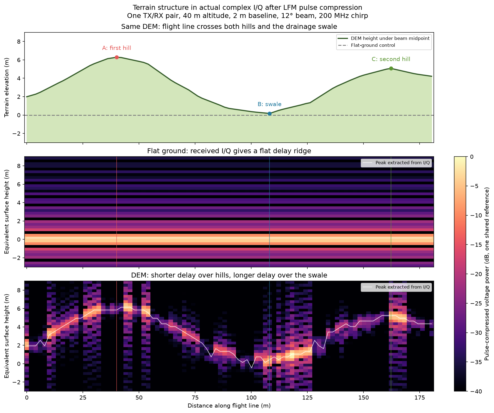
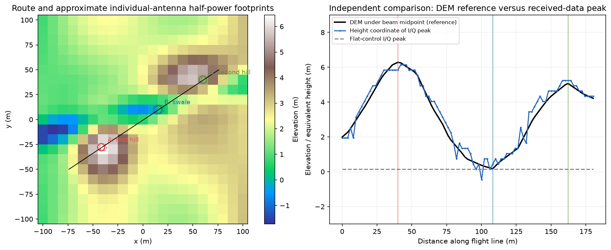
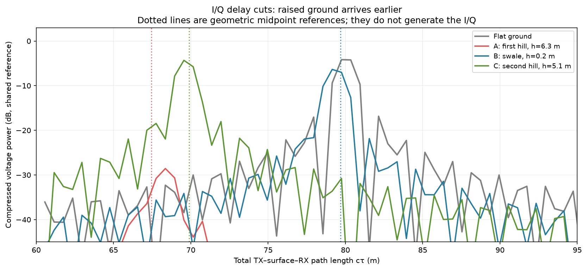
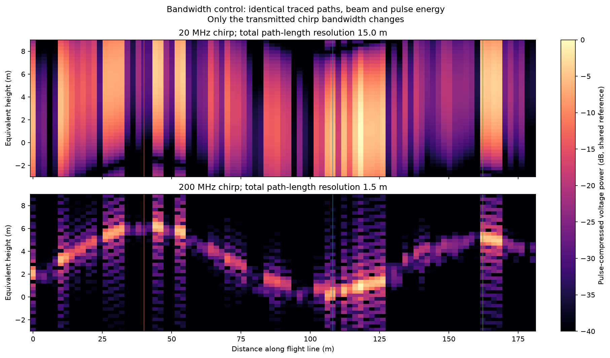

# Seeing terrain features in received I/Q

**Timing scope:** Mixed scope or architecture/reference document; each workload/table retains its stated timed operation. [Common measurement definitions](TIMING_CONVENTIONS.md) apply to units, statistics, cache state, ratios and comparisons. Historical measurements and estimates are not current fleet-update qualification.


**Runtime context (2026-10-05):** Offline focused terrain/radar demonstration, not a continuous multi-emitter runtime benchmark. See [current runtime and wall-clock costs](RUNTIME_STATUS.md) for comparable measurements, hardware, exclusions and ten-minute estimates.

Start with this focused scan to see how the existing DEM changes RF data. The
bright ridge below is calculated from **received complex voltage**, using LFM
pulse compression. The first hill, drainage swale and second hill are visible
in its changing delay. The DEM profile is shown separately for comparison.



The terrain has not been exaggerated or replaced. We changed the measurement
geometry and waveform so the existing features become resolvable. The raw
I/Q and compressed profiles are saved in
[`terrain_scan_iq.npz`](docs/figures/terrain_scan_iq.npz).

The [published-implementation comparison](ENVIRONMENTAL_RF_REFERENCES.md)
relates this scan to RadarSimPy's terrain altimeter and MathWorks' bistatic
land-clutter examples. It distinguishes the demonstrated geometry/delay
behavior from calibrated rough-ground amplitudes and slow-time statistics.

## Why the earlier plots hid the terrain

The [original scenario](TERRAIN_SCENARIO.md) moved only about 3 m near the center
of the DEM. It did not traverse the main hills. The aggregate channel waterfalls
also mixed 100 transmitter locations and many surface points. Their delay bins
do not identify a unique ground location.

Its 20 MHz LFM pulse resolves approximately **15 m of total path length**
(`c/B`). A 6 m change in near-nadir ground height changes the TX–ground–RX path
by roughly 12 m, and smaller features change it less. Those contributions blend
inside the pulse-compression response. The I/Q frequency spectrogram mainly
shows the transmitted chirp; it is not a topographic image.

This scan makes three explicit changes: a route across the features, a narrower
beam that localizes illumination, and a wider chirp that resolves delay. It is
a separate one-link demonstration, not a replacement for the 100-TX throughput
scenario or a new off-the-shelf hardware specification.

## What was simulated

| Parameter | Focused scan |
| --- | --- |
| Surface | Same 200 × 200 m DEM, 10 m grid, 800 triangles |
| Material | Same uniform permittivity 5, conductivity 0.01 S/m, thickness 0.5 m, scattering coefficient 0.3, Lambertian |
| Radios | One independent TX and RX, separated by 2 m along x |
| Altitude | Both at z=40 m above the fixed datum |
| Route | Approximately (−75, −50) to (+75, +50) m, about 180 m |
| Motion | Both travel at 10 m/s; 91 selected pulse epochs over about 18 s |
| Pulse clock | 200 Hz; selected snapshots are about 0.2 s / 2 m apart |
| Antennas | Downward, synthetic 12° full half-power beamwidth, vertical polarization |
| Pattern | Axisymmetric Gaussian with positive background floor; spherical average gain 1, peak ≈24 dBi |
| Carrier | 24.125 GHz |
| LFM | 200 MHz bandwidth, 2 µs pulse, 1 W, 50 Ω, noise disabled |
| Capture | 500 MS/s complex voltage, 1,500 samples / 3 µs |
| Propagation | Actual Sionna LoS, first-order specular and diffuse paths |
| Diffuse budget | 1,028 attempts/link, half TX and half RX proposals; 10% uniform support |



The circles show approximate individual-antenna half-power footprints: solid
for TX, dashed for RX. Their overlap concentrates surface contributions near
the baseline midpoint. Actual field gain is evaluated for every retained path;
these circles do not crop the mesh or select paths after tracing. Directional
proposals still preserve the uniform component and both antenna patterns.

We use the general one-way TX–surface–RX solver. We do not square a reciprocal
link, introduce point-target RCS, or substitute the DEM height into an analytic
echo generator. The DEM enters the RF calculation through its actual triangle
geometry, normals, visibility and material response.

## How the I/Q becomes the visible ridge

For every selected pulse, Sionna computes complex gains, absolute delays and
endpoint Doppler. `synthesize_voltage()` adds delayed, phase-shifted chirp copies
**coherently**. It computes the channel once per pulse and applies narrowband
Doppler during the receive window.

We correlate those complex samples with the transmitted chirp and divide by
the template's sample energy. All waterfall panels use one shared reference
for voltage magnitude squared; there is no normalization of individual rows,
terrain gain boost, smoothing or terrain-dependent path selection.

The measured ridge is the largest compressed I/Q peak in a fixed **60–100 m
total-path-length gate**. DEM elevations and predicted delays do not enter
that peak estimator. The vertical coordinate converts delay into an equivalent
height for a scatterer beneath the baseline midpoint:

```
L = c * delay
h_equivalent = 40 - sqrt((L/2)² - (2/2)²)
```

Higher ground shortens the path and appears higher in this coordinate. It is
not a general terrain inversion: off-nadir points with different positions and
elevations can have the same delay. The narrow overlapping beams make the
midpoint approximation useful here. Native sample spacing is about 0.60 m in
total path length, or 0.30 m near nadir in equivalent height. The 200 MHz
bandwidth gives approximately 1.5 m path-length resolution, about 0.75 m of
near-nadir height separation; sample spacing is not resolution.

Across the 91 snapshots, the I/Q peak coordinate and DEM midpoint profile have
correlation **0.985** and **0.35 m RMS difference**. This is a descriptive
comparison on this noise-free synthetic scene, not validated field accuracy or
a claim to reconstruct a DEM from arbitrary I/Q. Beam footprint, facets,
specular visibility and coherent interference cause departures from the
midpoint profile.

## Identify the individual features by their delays



| Feature | Distance along route | DEM midpoint height | I/Q peak equivalent height | Geometric reference total path |
| --- | ---: | ---: | ---: | ---: |
| A: first hill | 40.05 m | 6.28 m | 5.84 m | 67.46 m |
| B: swale | 108.15 m | 0.17 m | 0.44 m | 79.68 m |
| C: second hill | 162.25 m | 5.07 m | 5.24 m | 69.89 m |

Flat ground's reference path is about 80.02 m. The hills' responses arrive
earlier, while the swale approaches the flat-ground delay. Dotted lines are
geometric references calculated after simulation; they do not set the RF
peaks. The first hill is weaker on this shared absolute scale: facet slope and
specular alignment affect amplitude as well as delay. The ideal flat plane
produces a strong specular return; the terrain does not have to be equally
bright to show its shape.

## A bandwidth-only control



For each terrain snapshot, we reuse **exactly the same complex path gains,
delays and Dopplers** to generate another I/Q block with a 20 MHz chirp. Beam,
geometry, transmit power, pulse duration, receive window and sampling rate stay
the same. Only chirp bandwidth changes. The 20 MHz compressed response is much
broader; the 200 MHz response exposes the terrain ridge. This isolates the
delay-resolution effect from changes in terrain or ray coverage.

The DEM remains coarse and synthetic, with a homogeneous material. The model
still lacks persistent calibrated scatterer phases, roughness correlation and
validated slow-time speckle. We do not use SAR focusing or a slow-time Doppler
FFT here. The illustrated ridge demonstrates geometric delay structure in the
current coherent model; it does not validate those missing statistics.

## Reproduce and inspect the raw data

```bash
.venv/bin/python benchmarks/generate_terrain_signature.py
.venv/bin/python -m pytest -q
```

The script saves PNG/SVG plots, a
[scenario and comparison summary](docs/figures/terrain_signature_data.json)
and the complex-sample archive. The figure-generation run is not a GPU runtime
benchmark. `--backend cuda` refuses CPU fallback on a configured CUDA host.

```python
import numpy as np
from scipy.signal import correlate

with np.load("docs/figures/terrain_scan_iq.npz", allow_pickle=False) as data:
    iq = data["iq_dem"]                  # complex64 [91, 1500], volts
    fs = float(data["sample_rate_hz"])
    width = float(data["pulse_width_s"])
    bandwidth = float(data["bandwidth_hz"])
    t = np.arange(round(width * fs)) / fs
    template = np.exp(1j * np.pi * bandwidth * (t*t/width - t))
    profile = correlate(iq[20], template, mode="full", method="fft")
    profile = profile[len(template)-1:] / np.sum(np.abs(template)**2)
    path_length_m = np.arange(len(profile)) * 299792458 / fs
```

The archive also contains `iq_flat`, `iq_dem_20mhz`, compressed complex profiles,
pose/pulse metadata and the separately labeled DEM reference. The CPU test
container includes the archive and generator:

```bash
mkdir -p recordings
docker run --rm --network none --user "$(id -u):$(id -g)" \
  -v "$PWD/recordings:/work" ghcr.io/wa200508/airsim-rf:latest \
  python /opt/airsim-rf/benchmarks/generate_terrain_signature.py --output-dir /work/terrain_scan
```

<!-- BEGIN SIGNAL TIME CONTEXT -->

**Simulation-time reference:** use **wall seconds per simulated signal second**, not an unlabeled whole-run time. For fixed windows, divide mean service milliseconds by samples/sample-rate × 1,000. Stage costs use their parent window denominator. Geometry-only solves and analytic operation counts have no generated signal duration; a signal-time ratio is **not applicable**, unless an explicit update interval is assumed and labeled as a scheduling estimate. Unrecorded flight costs remain unknown. See [recorded normalized cases](SIGNAL_TIME_RESULTS.md).

<!-- END SIGNAL TIME CONTEXT -->
