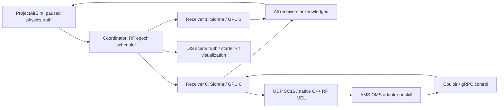

# Architecture

The current sensor-observable figures are in the [RF sensing analysis](sensing-plots.md), including radar delay profiles, ESM spectral diagnostics and passive-geolocation ambiguity plots. Earlier illustrations below are retained as linked scenario background.

- [Radar](#radar)
- [End To End](#end-to-end)
- [Cots Sdr Lab](#cots-sdr-lab)
- [Distributed](#distributed)
- [Ams Gra Compatibility](#ams-gra-compatibility)
- [Distance2Gol](#distance2gol)

<a id="radar"></a>

## Drone-mounted pulsed LFM radar


The prototype triggers one linear frequency-modulated pulse from the drone's
antenna location and returns complex baseband voltage samples over one pulse
repetition interval. Transmit and receive antennas occupy the same location.
Sionna computes a direct one-way path to each specified point target; the model
constructs the reciprocal return path and applies a scalar radar cross-section.

### Run it

```bash
cd airsim-rf
.venv/bin/python examples/lfm_radar.py
.venv/bin/python -m pytest -q
```

The example drone flies at 20 m/s toward two targets, at the same altitude of
50 m. Targets have true ranges of 300 m and 600 m, and RCS of 1 and 16 m²,
respectively. Their voltages are roughly equal: the farther target's increased
RCS compensates for its additional two-way loss. The example is noiseless by
default; `--noise` enables thermal receiver noise with a 4 dB noise figure.

The noiseless verified outputs are 299.79 m and 599.58 m after matched filtering,
and +1334.26 Hz Doppler for both targets. Positive Doppler means decreasing
range. Range estimates are quantized to the 3.00 m sample spacing, while nominal
range resolution is 7.49 m. No CFAR detection or range interpolation is applied.

| Parameter | Default |
| --- | --- |
| Carrier | 10 GHz |
| LFM bandwidth | 20 MHz, from -10 to +10 MHz baseband |
| Pulse duration | 1 µs |
| Pulse repetition interval | 100 µs (10 kHz PRF) |
| Complex sample rate | 50 MS/s |
| Receive window | 5000 samples |
| Peak transmit power | 100 W (1 W average at 1% duty cycle for a pulse train) |
| Antennas | One isotropic, vertically polarized antenna per endpoint |
| Loaded voltage impedance | 50 Ω, RMS complex-envelope convention |
| Receiver blanking | First 1 µs blanked during transmission |
| Receiver noise | Disabled; optional 290 K, 4 dB noise figure |

These are editable starting parameters in `RadarConfig`, not a hardware
specification. Blanking gives a nominal full-pulse minimum range near 150 m;
nearer targets can have truncated echoes. A full echo must arrive before the
receive window ends, near 14.84 km with these settings. This single-pulse model
does not alias echoes from earlier pulses into the window.

### Work with raw samples

`lfm_radar.npz` contains raw `iq_volts` (complex64), the sampled transmitted
chirp, pulse parameters, carrier/sample rate, voltage impedance, sim timestamp,
target truth metadata, valid round-trip delays, and a separately derived
complex matched-filter range profile. I is the real part and Q the imaginary
part. No dechirping or range processing is embedded in the raw I/Q.

```python
import numpy as np
from scipy.signal import correlate

with np.load("lfm_radar.npz") as data:
    iq = data["iq_volts"]
    tx = data["tx_template"]
    fs = float(data["sample_rate_hz"])
    compressed = correlate(iq, tx, mode="full", method="fft")[len(tx)-1:]
    ranges = np.arange(len(compressed)) * 299792458.0 / (2*fs)
```

The package's `range_compress()` also divides by the chirp's discrete energy,
so its output has units of complex volts. Raw matched-load echo power is
`abs(iq)**2 / impedance_ohm`, before pulse averaging.

### Attach it to ProjectAirSim

A simulator must be running separately. This example loads the supplied scene
and leaves it paused after triggering the radar pulse:

```bash
.venv/bin/python examples/airsim_lfm_radar.py \
  --model pulsed \
  --scene scene_drone_sensors.jsonc \
  --sim-config .deps/ProjectAirSim/client/python/example_user_scripts/sim_config/ \
  --robot Drone1 \
  --target-ned 300 0 -50 1 \
  --target-ned 600 0 -50 16 \
  --output airsim_lfm_radar.npz
```

Each `--target-ned` specifies a stationary point target's north/east/down
coordinates in meters and RCS in m². Targets are explicitly defined RF
scatterers; they are not inferred from scene actors. Ranges are measured from
the actual drone pose, so the sample coordinates above only give 300/600 m
ranges when the drone is at NED `(0,0,-50)`.

`--mount-body X Y Z` places the antenna relative to the drone body origin;
the adapter includes rotational lever-arm velocity. The adapter reads the
paused drone's ground-truth position, orientation, and velocity, converts NED
to the RF scene's north/west/up basis, and supplies the sim timestamp. Live
simulator capture has not been verified here; the adapter is source-checked
and unit-tested with a simulated client.

With no `--rf-scene`, propagation is free space. An aligned Mitsuba scene can
provide line-of-sight obstruction via `--rf-scene`; export geometry in meters,
with x north, y west, z up and the AirSim world origin. Point targets must be
placed in free space rather than inside an opaque target mesh, since this
solver treats them as virtual radio endpoints, not mesh scattering surfaces.

For repeated pulses, advance the paused simulator by a PRI between calls to
`AirSimRadarBridge.capture(targets)` and retain the actual sim timestamps. A
moving target can be supplied through `PointTarget.velocity_m_s`, but its
position must also be updated by the caller at each pulse epoch. During each
short receive window, geometry and envelope delay are frozen and carrier
Doppler evolves from the supplied velocities. Continuous pulse scheduling,
physics-step quantization, and overlapping-window handling remain the caller's
responsibility.

### Echo model and limits

For isotropic aligned antennas in free space the model is calibrated to:

```text
tau = 2*R/c
fD = -2*radial_range_rate/lambda
Pr = Ppeak * lambda² * sigma / ((4*pi)³ * R⁴)
v(t) = sqrt(Z*Ppeak) * h_echo(t) * chirp(t-tau)
```

The Sionna one-way coefficient already includes loss, carrier delay phase,
polarization coupling, and Doppler. The reciprocal monostatic echo coefficient
is `h_oneway(t)**2 * sqrt(4*pi*sigma)/lambda`, doubling phase and Doppler while
giving the radar equation's power scaling. The scalar target scattering phase
is set to zero; RCS alone does not describe a real target's scattering phase or
polarimetric response. Vertically polarized virtual target antennas are a
simple polarization approximation. Antenna tilt can affect coupling, but a
directional radar beam pattern is not modeled.

This model does not calculate full electromagnetic mesh scattering, multipath
radar echoes, clutter, receiver leakage, oscillator phase noise, or ADC effects.
The matched-filter example has no sidelobe window, and the rectangular LFM
pulse produces the expected range sidelobes. Optional noise assumes ideal
full complex Nyquist bandwidth. Raw samples represent one triggered pulse;
slow-time Doppler estimation requires a coherent sequence of pulses and enough
observation time. The reported target Doppler values are truth metadata, not
velocity estimates from the single-pulse matched filter.

The current integration is a Python sensor adapter. Publishing radar I/Q as a
native ProjectAirSim sensor topic and testing it with a live simulator remain
the next integration steps. FMCW would instead use repeated continuous chirps
and a receive dechirping stage; it is not the implemented waveform here.

<a id="end-to-end"></a>

For P100 CUDA/OptiX propagation and CuPy rendering, see [the explicit GPU pipeline](archive/planning.md#p100-gpu-pipeline). Historical rows below use their recorded LLVM propagation backend.

## Historical end-to-end RF tests

On `profiling/p100`, the optimized CPU/CUDA basis renderer is connected to
`SDRNetworkReceiver`. The end-to-end runner exercises **moving-platform truth
→ AirSim mount bridge → real terrain multipath → private arbitrary sampled
waveforms → all-path Doppler rendering → thermal noise → persistent receiver
filter → 12-bit ADC → SC16 serialization → HTTP consumer → file readback**.
Every channel is recomputed each update. No scene paths are cached across
updates, discarded by strength, or replaced with synthetic stress-test paths.

### Run the tests

```bash
git switch profiling/p100
.venv/bin/python -m pytest tests/test_end_to_end.py tests/test_sdr.py tests/test_distributed.py -q
```

The integration tests compare the scene-derived basis output with the direct
all-path renderer over several moving epochs. A separate split/unsplit test
checks receiver filter continuity. Another test runs real terrain propagation,
two independent transmitters, two receivers and four consecutive receive
windows through an actual localhost HTTP consumer, validates the SC16 records,
and checks that no samples are skipped or duplicated.

The distributed tests separately exercise the existing radar worker’s native
AMS-GRA gRPC control, UDP data and coordinator. **The new continuous SDR/basis
pipeline is not yet connected to that distributed worker protocol.** Neither
suite stands in for a live AirSim + distributed continuous-SDR fleet test.

### Historical hybrid collection commands

One command runs the integration suite and all three fleet sizes (2×2, 10×4,
100×10), saving one combined report, a validation manifest, environment record,
checksums, logs and nested Markdown/JSON results:

```bash
.venv/bin/python scripts/run_end_to_end_profile.py \
  --backend both --iterations 30 --warmup 3 \
  --run-id p100-end-to-end-full
```

Use `--backend cpu` in a CPU-only environment, or `--backend cuda` to collect
only hybrid CPU-propagation/CUDA-rendering runs. The default `both` collection
fails at preflight if a working CuPy device is unavailable. Every GPU scenario
also gets a separate 30-window instrumented run, which fills all seven internal
CUDA stage columns with median ± standard deviation and p95. Those statistics
are kept separate from unprofiled RF fleet-update throughput. Missing stages or
scenario rows make aggregation fail. CUDA integration
checks run against the direct scene-derived oracle when that device is present.

The standalone commands below select a single configuration:

```bash
## Complete requested fleet: 100 independent TX, ten RX; CPU propagation/rendering.
.venv/bin/python benchmarks/benchmark_end_to_end.py \
  --tx 100 --rx 10 --iterations 30 --warmup 3 \
  --output results/end_to_end/cpu-100tx-10rx

## Your smaller flight configuration: ten TX, four RX.
.venv/bin/python benchmarks/benchmark_end_to_end.py \
  --tx 10 --rx 4 --iterations 30 --warmup 3 \
  --output results/end_to_end/cpu-10tx-4rx

## On the P100: same full scene-to-consumer pipeline, CuPy rendering.
.venv/bin/python scripts/basis_launch.py benchmarks/benchmark_end_to_end.py \
  --renderer basis-cuda --tx 100 --rx 10 --iterations 30 --warmup 3 \
  --output results/end_to_end/p100-100tx-10rx
```

Use the profiling container’s Python instead of `.venv/bin/python` where
appropriate. Run the P100 command with the container entrypoint overridden to
`python` and `--gpus all`, using the existing CUDA-enabled profiling image setup
in [P100_BASIS_PROFILING.md](setup.md#p100-basis-profiling). The selected rendering
backend fails explicitly if CUDA is unavailable; it never silently falls back.

The suite writes `results/profiling/<run-id>` by default. Use
`bash scripts/run_p100_docker.sh --end-to-end --run-id p100-end-to-end-full`
for the Docker version; see [P100 collection details](setup.md#complete-rf-pipeline-fill-every-stage-row).

Each output directory must be new. It contains `measurements.json`, `REPORT.md`,
and local `captures/*.sc16` files. Publish the JSON and Markdown, rather than
all raw I/Q. `REPORT.md` puts processing steps in columns with median ± sample
standard deviation and a separate p95 table. The synchronized outer timer
includes source generation, mount snapshot mapping, path solving/export,
rendering, receiver processing, serialization, loopback transport,
acknowledgement and consumer write/readback. Writes are not fsync-ed. The first
capture is recorded separately; warmup and setup are excluded from steady-state
statistics. The runner does not assert that latency is below 8.333 ms: it reports
actual deadline misses and wall/simulated-time ratio.

At 2 MS/s and 120 Hz, windows alternate **16,667 / 16,666 / 16,667 samples**.
Their timestamps follow cumulative integer sample counts, so the stream is
continuous. Receiver filter state persists; it is not restarted with a synthetic
warmup for each capture. Input buffers retain actual overlapping history and
lookahead. A new private sampled buffer is allocated for every directed link;
no input transforms are shared between receiver jobs. Receiver jobs execute
**sequentially on one device**, so the measurements credit no unmeasured
one-GPU-per-receiver parallelism.

The propagation budget is **1,028 diffuse attempts per directed link**, drawn
from both antenna patterns, plus LoS/specular candidates. Occlusion and ray
misses determine the number of physical paths. JSON records those counts for
every receiver and epoch. This differs from the renderer stress test’s **1,028
valid paths per link**. The scene has 800 terrain triangles and the documented
synthetic dielectric/scattering material; no extra bounce depth is introduced.
Channels stay fixed over a window, with narrowband Doppler phase evolving at
every sample. Both basis backends retain their declared 100 µs delay bound,
±2,500 Hz Doppler bound, 32 interpolation taps and 2,048-sample blocks.
Paths outside those limits fail instead of being clipped. Source/receiver clocks
are nominally equal; clock-rate resampling remains unqualified.

**The historical commands in this chapter run Sionna propagation on LLVM CPU.** The default production dependency stack rejects the P100. The explicit compatibility stack now supports CUDA/OptiX propagation; see [current performance](performance.md). Therefore this is a
hybrid CPU-propagation/GPU-rendering measurement, not a GPU-only fleet claim.

### Run with actual ProjectAirSim physics and RPC

By default, the runner uses a deterministic curved-trajectory source exposing
the same paused-world/robot API that `AirSimSDRBridge` consumes. It executes the
real RF pipeline and consumer, but **does not exercise the AirSim executable,
physics engine or network RPC**.

Start a ProjectAirSim server and install the optional ProjectAirSim Python
client. Supply a JSON mapping every `txN` and `rxN` to a live drone:

```json
{
  "address": "127.0.0.1",
  "scene": "scene_config.jsonc",
  "sim_config": "/path/to/ProjectAirSim/client/python/example_user_scripts/sim_config",
  "robots": {"tx0": "Drone1", "rx0": "Drone2"}
}
```

```bash
.venv/bin/python benchmarks/benchmark_end_to_end.py \
  --tx 1 --rx 1 --iterations 30 --warmup 3 \
  --airsim-config live-radios.json \
  --output results/end_to_end/live-airsim
```

The live server must advance and pause at each requested RF epoch on the 500 ns
sample grid. The runner rejects an overshoot or gap rather than dropping I/Q.
A server configuration whose physics ticks cannot pause at those epochs needs
truth interpolation/scheduling integration before this live test can pass.
The RF terrain must also agree with the AirSim scene coordinates; this runner
does not import the AirSim world geometry. Drone flight controllers and paths
must be configured in the live scene. Live mode has not been run in this cloud
workspace; it fails without a server and never substitutes trajectory data.

An end-to-end distributed AirSim/AMS-GRA continuous-I/Q demonstration still
requires those live scheduling and SDR-worker integrations. This document names
that remaining scope rather than calling the automated RF test a completed
simulation-plane deployment.

### Recorded cloud CPU integration runs

[The central timing document](archive/runtime.md#end-to-end-rf-pipeline-median--sample-standard-deviation)
contains the complete-stage median ± standard deviation and p95 tables for:

- [100 TX / ten RX, five measured windows](../results/end_to_end/cpu-100tx-10rx-20261005/REPORT.md).
- [Ten TX / four RX, ten measured windows](../results/end_to_end/cpu-10tx-4rx-20261005/REPORT.md).

Both use an AMD EPYC 9V74 host with a two-core cgroup quota, CPU propagation and
CPU rendering. These short scene-to-consumer measurements are not Ryzen or P100
measurements, nor ten-minute flight tests. The environment record is
[environment.json](../results/end_to_end/environment.json). The raw SC16 captures
stay local; the recorded reports/JSON are committed for reproduction.

<a id="cots-sdr-lab"></a>

## A COTS SDR starter lab: four drones, two emitters, two listeners


**Runtime context (2026-10-05):** The plotted COTS lab uses short scheduled captures; sensor sample rate and configured update rate do not establish continuous wall-clock real-time operation. See [current runtime and wall-clock costs](archive/runtime.md#runtime-status) for comparable measurements, hardware, exclusions and ten-minute estimates.

The first SDR target is **Analog Devices ADALM-PLUTO (PlutoSDR)**. The new
example puts four radio mounts in the same RF terrain scene: two emit known
beacons and two listen passively. Each listener receives the coherent sum of
both emitters through actual Sionna environmental paths, then a sampled receive
chain produces 12-bit I/Q. The same radio hardware can later support
communications or carefully designed bistatic radar exercises.

This is a **specification-based model**, not a calibrated digital twin. It
enforces the published tuning, bandwidth and nominal ADC resolution. Noise
figure, receive gain/full scale, antenna installation and environmental
scattering remain explicit assumptions. Use the model to test algorithms,
identify hardware constraints and plan measurements; absolute purchase decisions
about detection range require calibration and a specified detector.
ADI likewise distinguishes a radio's capabilities from the range/rate of a
complete waveform, antenna and environment-dependent link [6](#ref6).

These SDR figures describe simulated received I/Q over the recorded terrain.
Execution backends are recorded in the dataset provenance.
[Reproduction and capture durations](setup.md#regenerate-documentation-figures-on-the-p100).

[Earlier demonstration illustration: Four radio mounts, received link powers and recorded I/Q spectra](figures/pluto_esm_overview.png)

### Why start with PlutoSDR

ADI publishes **325 MHz–3.8 GHz** tuning, **20 MHz maximum instantaneous RF
bandwidth**, **12-bit ADC/DAC**, and one exposed TX plus one exposed RX, with
half- or full-duplex operation [1](#ref1), [2](#ref2). GNU Radio, libiio and Python tooling are
available. This matches a university RF laboratory much more closely than
assigning a synthetic 24 GHz radar waveform to arbitrary SDR hardware.

The detailed specifications distinguish internal converter rates from host
streaming: they list up to 61.44 MS/s internally, but USB streaming up to
**4 MS/s without dropped samples** [2](#ref2). Our default is **2 MS/s**, not a promise
that a host can continuously stream a 20 MHz channel. Hardware/host performance
still needs checking on the intended computer.

On **2026-10-03**, Nooelec listed ADALM-PLUTO at **US$349.95** [7](#ref7). Four radios
therefore have an indicative subtotal of **US$1,399.80**, before taxes, shipping,
antennas, cables, mounts, power, computers and drones. The page showed three
units left; four-unit availability is not established. A planning allowance of
roughly $400–$500 per RF payload can include modest antennas/cables, but only
the radio price above was retrieved as an actual currency-qualified quote.

| Candidate | Appropriate exercise | Main constraint | Repository status |
| --- | --- | --- | --- |
| PlutoSDR [1](#ref1), [2](#ref2) | Passive RF sensing, communications, separated TX/RX waveform experiments | 20 MHz RF bandwidth; host streaming and independent clock limits | New multi-emitter/multi-receiver example and sampled front end |
| RTL-SDR Blog [8](#ref8) | Lowest-cost receive-only experiments in supported bands | No transmitter; narrower bandwidth and lower converter resolution | Alternative to investigate; no RTL-specific calibrated model added |
| HackRF One [9](#ref9) | Broad tuning and transmit/receive experiments | Half duplex; nominal 8-bit I/Q | No HackRF model added; numeric 8-bit control is not a product comparison |
| Infineon Distance2GoL | Dedicated 24 GHz FMCW radar | Specialized RF/IF chain and antenna; not a general SDR | Existing [hardware radar profile](architecture.md#distance2gol), currently point-target based |
| TI IWRL6432BOOST [10](#ref10) | Dedicated 57–64 GHz radar, multiple radar channels | Raw ADC capture needs a supported data path; TI documents DCA1000EVM | Hardware candidate, not yet a modeled profile |

Pluto cannot directly receive 24 GHz Distance2GoL or 60 GHz radar emissions.
Observing those emitters needs another RF frontend/downconverter or different
hardware. A simulator can share their scene geometry while evaluating separate
frequency bands; that does not extend a physical radio's tuning range.

### Reproduce the virtual experiment

From a bootstrapped checkout:

```bash
.venv/bin/python examples/pluto_esm_drones.py --output-dir recordings/pluto_esm
.venv/bin/python -m pytest tests/test_sdr.py -q
```

After the container workflow publishes this revision:

```bash
mkdir -p output
docker run --rm --network none --user "$(id -u):$(id -g)" \
  -v "$PWD/output:/work" ghcr.io/wa200508/airsim-rf:latest \
  python /opt/airsim-rf/examples/pluto_esm_drones.py --output-dir /work/pluto_esm
```

For a quick container smoke test, use `--epochs 2 --samples 1024
--samples-per-link 128`. That reduced sampling run checks execution, not the
default ground-scattering fidelity. The documented run uses **1,028 attempted
diffuse samples per independent TX/RX link**, covering both antenna patterns.
CUDA is selectable with `--backend cuda` only in an environment with the required
GPU runtime; the published CPU container does not establish GPU performance.

See [SDR runtime](archive/planning.md#sdr-runtime) for measured update throughput, service latency, and the current hybrid CUDA bottleneck. A nominal update cadence does not demonstrate real-time execution.

The command saves:

* `pluto_esm_iq.npz`: raw input-referred analog I/Q, reconstructed ADC I/Q,
  signed ADC codes, a numeric 8-bit control, epochs and complete model metadata.
* `pluto_esm_report.json`: hardware constraints, assumptions, per-link powers,
  receiver noise budgets, retained path counts, clipping and clocks.
* `pluto_esm_overview.png` and `pluto_esm_waterfalls.png`: received-data plots.
* `listener_a.sigmf-data` / `.sigmf-meta` and corresponding listener B files:
  the final contiguous block, signed I/Q in little-endian int16 containers,
  with metadata identifying its 12-bit simulated conversion [11](#ref11).

The documented [raw recording](figures/pluto_esm_iq.npz) and
[report](figures/pluto_esm_report.json) are also checked in for inspection.

### Scenario and published constraints

| Parameter | Value | Evidence/status |
| --- | --- | --- |
| Physical target | ADALM-PLUTO | Purchasable hardware [1](#ref1), [7](#ref7) |
| Carrier | 915 MHz | Scenario choice within published tuning range |
| Beacons | Continuous complex tones at +150 kHz and −200 kHz | Controlled laboratory waveforms; no particular commercial emitter claimed |
| TX port powers | 0 dBm and −30 dBm | Chosen calibrated-port-power inputs; not a DAC/gain-setting prediction |
| Antennas | Ideal vertical half-wave dipoles at each mount | Approximately 2.15 dBi horizontal gain; not measured installed antennas |
| Receive channel bandwidth | 1 MHz | Choice within published 200 kHz–20 MHz range [2](#ref2) |
| Sample rate | 2 MS/s nominal | Choice below documented 4 MS/s USB streaming figure [2](#ref2) |
| Capture | 4,096 complex samples, about 2.048 ms | Short, frozen-channel block |
| ADC | Signed 12-bit I and Q, stored in int16 | Nominal resolution from [1](#ref1), [2](#ref2); ideal quantizer, not measured ENOB |
| Clock errors | TX +12/−8 ppm; RX +5/−10 ppm | Chosen values; ADI illustrates ±25 ppm initial Pluto accuracy [3](#ref3) |
| Channel update schedule | Nominal 200 Hz; every 100th epoch recorded | Twelve selected captures, 0–5.5 s; skipped ticks are not simulated |
| Surface | Existing 200 × 200 m hills/swale DEM, 800 triangles | Synthetic, uniform RF material |
| Paths | LoS plus at most one specular/diffuse surface interaction | General one-way propagation, no reciprocal radar-channel squaring |
| Proposed samples | 1,028 per link, four links | Attempts; misses and blocked samples are not retained paths |

All coordinates below are **RF x north, y west, z up**, in metres, matching
the [AirSim transform](#attach-it-to-projectairsim). Antennas are at
the nominal datum heights below unless the DEM requires a climb to retain
5 m clearance. The current mesh spans 0–30 m. Actual poses and local vertical
velocities are recorded per capture in [the source report](figures/pluto_esm_report.json).
The trajectory is prescribed geometrically; no autopilot dynamics are simulated.

| Mount | Role | Nominal start x/y/z (m) | Nominal velocity x/y/z (m/s) |
| --- | --- | --- | --- |
| beacon_a | Strong emitter | −60 / −30 / 12 | 2 / 0 / 0 |
| beacon_b | Weak emitter | 45 / 45 / 18 | −1 / 0 / 0 |
| listener_a | Passive receiver | −30 / −10 / 14 | 3 / 0 / 0 |
| listener_b | Passive receiver | 30 / −50 / 20 | 0 / 3 / 0 |

Every listener observes **both** beacons. The two-beacon powers are intentionally
unequal so students can investigate a weak signal in the presence of a stronger
one. The scenario is a passive spectrum-sensing exercise, not an emitter
classifier, direction finder, localization system or target-detection algorithm.

### How the radio model changes the RF data

`SDRNetworkReceiver` solves all scene links once at a capture epoch. Native
Sionna supplies complex path coefficients, absolute delays and endpoint Doppler.
Each delayed continuous waveform is weighted by its own port power and channel.
Those contributions sum **before** the listener's receive chain. There is one
thermal-noise realization per receiver, not one per transmitter.

Each radio has a chosen independent oscillator phase and reference error. The
same reference error affects its LO and sample rate. TX waveform timing/LO error
is applied before propagation; RX LO error is removed at the receive mixer. At
915 MHz, just **10 ppm of relative error means 9.15 kHz of frequency offset**,
much larger than typical drone-speed Doppler. A shared simulator clock does not
make inexpensive radios phase synchronized.

The receive-chain model adds white, input-referred thermal noise from `kTF`,
passes the signal/noise through a fourth-order Butterworth low-pass approximation,
and quantizes I and Q separately. Filter warm-up samples are discarded. Its
integrated noise budget uses the filter's calculated equivalent noise bandwidth,
approximately 1 MHz for the default configuration. The ideal ADC clips
independently at each component's signed rails.

The full-scale input setting is **−30 dBm** by default. This means an input
complex sinusoid at −30 dBm reaches full-scale component amplitude; it is a
chosen input-referred manual-gain calibration parameter, not a published Pluto
maximum input rating or a measured ADC-pin voltage. Changing receive gain in
real hardware changes that mapping and can also change noise figure.
ADI's receive documentation emphasizes that reception fidelity and sensitivity
depend on frequency and configuration [5](#ref5).

The default **10 dB noise figure is an assumption**. ADI's sensitivity discussion
quotes 2.5 dB at maximum receive gain [4](#ref4), but that is not a universal figure
for every frequency/gain setting. Our model deliberately exposes this setting;
it does not claim the chosen gain/full-scale/noise combination has been measured.

The same analog samples are also converted by an ideal 8-bit quantizer. This
isolates numerical resolution effects while holding propagation, noise and
clocks fixed. Its spurs/noise depend on waveform and input level. An 8-bit ADC
can still reveal a weak narrowband tone through integration; nominal bit count
alone is not a detection-range specification. This control is **not a calibrated
HackRF comparison**, and nominal ADC bits are not effective resolution.

The filter is currently a digital approximation for already-in-band inputs.
Emitter waveforms must declare frequency bounds; bounds including clock offsets
that exceed receiver Nyquist are rejected. This is not an analog out-of-band
blocker, compression, intermodulation or alias-rejection model. The current
approximation also requires receive bandwidth below output sample rate.

### What the tested example shows

At the final capture (**5.5 s**) in [the current source report](figures/pluto_esm_report.json):

| Receiver | Beacon A link power | Beacon B link power |
| --- | ---: | ---: |
| listener_a | −99.78 dBm | −95.00 dBm |
| listener_b | −65.89 dBm | −95.50 dBm |

These link powers precede receiver noise (approximately −103.98 dBm per listener).
Terrain blocks Beacon A's direct path to listener A; reflected/diffuse reception
remains possible. Neither 12-bit capture clips. These are model outputs, not
measured Pluto hardware or calibrated rough-ground backscatter. See the
[power and visibility history](sensing-plots.md#power-clearance-and-terrain-blockage).

The oscillator choices put the nominally sampled tones near:

| Receiver | Beacon A | Beacon B |
| --- | --- | --- |
| listener_a | +156.4 kHz | −211.9 kHz |
| listener_b | +170.1 kHz | −198.2 kHz |

These values exclude the small path-dependent Doppler. Welch spectra use
1,024-sample segments at 2 MS/s, so approximately 1.95 kHz bins do not resolve
the tens-of-hertz motion contributions. Differences between listeners are
principally chosen reference-clock offsets here.

[Earlier demonstration illustration: Two listeners' recorded 12-bit spectrum waterfalls](figures/pluto_esm_waterfalls.png)

The new tests independently check actual Sionna free-space link power against
Friis for two TX and two RX, coherent cancellation before quantization,
oscillator/sample-clock effects, one receiver-noise draw independent of emitter
count, filtered thermal noise power, clipping/quantization, rejection of invalid
hardware settings, and actual terrain paths. The AirSim bridge has a paused
network-snapshot/coordinate-transform check. None uses physical SDR measurements.

### Use the data in an SDR workflow

```python
import json
import numpy as np

with np.load("pluto_esm_iq.npz") as recording:
    iq = recording["adc_iq_volts"]     # complex64 [epoch, receiver, sample]
    codes = recording["adc_codes"]    # int16 [epoch, receiver, sample, I/Q]
    fs = float(recording["sample_rate_hz"])
    report = json.loads(str(recording["profile_json"]))
    final_listener_a = iq[-1, 0]
```

Input-referred `input_iq_volts` includes receiver noise after filtering.
Per-link powers in the report are separate signal-only diagnostics; their sum
need not equal instantaneous combined power because signals add coherently.
The reconstructed ADC volts use the chosen input calibration.

The SigMF files hold I/Q counts, with I then Q in signed little-endian int16.
They can feed compatible SDR analysis tools. The NPZ epochs are separated by
0.5 s; **do not concatenate them as a continuous stream or a coherent CPI**.
Only the final contiguous block is exported as SigMF. Recorded simulation times
and oscillator values are truth metadata, not evidence that purchased radios
supply synchronized timestamps.

The model accepts other continuous, unit-power callable waveforms through
`SDREmitter`, with explicitly declared frequency bounds. Signal processing is
kept separate from the channel/receive-chain machinery, as in the
[published RF implementations](references.md#environmental-rf-references).

### Attach the radios to AirSim and the simulation plane

`AirSimSDRBridge` maps every scene radio to a ProjectAirSim robot handle, reads
all mounts at one paused world timestamp and updates position, orientation and
lever-arm velocity using the existing NED-to-RF transform:

```python
from airsim_rf.sdr_bridge import AirSimSDRBridge

## network is an SDRNetworkReceiver; world/robots are live ProjectAirSim handles.
bridge = AirSimSDRBridge(world, {
    "beacon_a": drone_a, "beacon_b": drone_b,
    "listener_a": drone_c, "listener_b": drone_d,
}, network, mounts_body_m={"listener_a": [0.1, 0, 0]})
## The caller pauses/steps the world at the desired capture epochs.
captures = bridge.capture(num_samples=4096)
```

This mapping is tested with simulated SDK handles. A live four-drone AirSim
flight has **not** been exercised here. Supply aligned RF scene meshes/materials;
the synthetic DEM is not automatically exported from Unreal or synchronized
with AirSim's visual terrain. The caller controls stepping and capture gaps.

The new receiver is a reusable one-way RF backend suitable for future
per-receiver GPU workers. The existing distributed worker/MEL demo still uses
the Distance2GoL point-target radar request schema; this change does not silently
convert that protocol into an ESM worker. Emission schedules, receiver settings,
multi-band routing, synchronization and waveform transport require a deliberate
protocol extension before claiming an operational general AMS-GRA RF plane.

### How this can inform a hardware purchase

Start with questions the model can answer under stated assumptions:

1. **Does the radio cover the band and bandwidth?** Pluto's 20 MHz limit gives
   approximately 7.5 m monostatic range resolution at full bandwidth, or 15 m
   total-path resolution for a separated TX/RX interpretation. It cannot deliver
   our 200 MHz terrain demo's approximately 0.75 m monostatic resolution. Our
   default 1 MHz passive receive channel is not a ranging configuration.
2. **Can the chosen processing handle unequal powers and clock offsets?**
   Vary `--weak-power-dbm`, `--full-scale-dbm` and `--noise-figure-db`; compare
   `--ideal-clocks`. Design synchronization and detection on received samples,
   then evaluate error/detection rates with a declared detector and thresholds.
   The present example plots spectra rather than implementing that detector.
3. **How sensitive is the result to the environment?** Compare `--propagation
   los`, `specular` and `diffuse` with the same hardware settings. Current diffuse
   samples are not persistent ground scatterers; revisit the
   [coherence and calibration limitations](terrain.md#ground-scattering) before using
   clutter amplitude, slow-time spectra or route fading as purchase evidence.
4. **What must be measured on one borrowed or purchased unit?** Use a calibrated
   injected tone/attenuator to map ADC counts to RF input power versus gain and
   frequency; characterize noise/receive filtering, reference error, phase noise,
   TX port power and usable USB rate. Replace the exposed assumptions with those
   measurements before extrapolating quantitative performance.
5. **Which additional hardware is required for radar?** Pluto supports full
   duplex, but monostatic radar needs TX/RX isolation, leakage handling and a
   suitable waveform/clock arrangement. ADC clipping alone does not model RF
   saturation. Separated bistatic radios need synchronization and direct-path
   interference handling. A dedicated radar board may be the economical answer
   if range resolution and RF isolation dominate the requirement.

The ADC model omits AGC dynamics, RF compression/intermodulation, TX leakage,
DAC quantization/EVM, oscillator phase-noise spectra, LO spurs, I/Q imbalance,
DC offsets, acquisition jitter and USB drops. The antenna model omits feed loss,
airframe scattering and installed-pattern measurements. Terrain material and
diffuse statistics are synthetic. These omissions are recorded with the saved
data so an attractive plot cannot be mistaken for calibrated purchase evidence.

### References

Sources checked 2026-10-03. Prices and availability can change.

<a id="ref1"></a>
**[1] Analog Devices.** [ADALM-PLUTO evaluation board](https://www.analog.com/en/resources/evaluation-hardware-and-software/evaluation-boards-kits/adalm-pluto.html).
Published tuning, 20 MHz bandwidth, 12-bit ADC/DAC, duplex and software support.

<a id="ref2"></a>
**[2] Analog Devices.** [ADALM-PLUTO detailed specifications](https://wiki.analog.com/university/tools/pluto/devs/specs).
Tunable bandwidth, output-rate limits and USB streaming distinction.

<a id="ref3"></a>
**[3] Analog Devices.** [Phase Noise and Frequency Accuracy](https://wiki.analog.com/university/tools/pluto/users/phase_noise).
Independent frequency-error/drift discussion and ±25 ppm initial-accuracy example.

<a id="ref4"></a>
**[4] Analog Devices.** [Receiver Sensitivity](https://wiki.analog.com/university/tools/pluto/users/receiver_sensitivity).
Thermal-noise/noise-figure explanation; quoted 2.5 dB at maximum RX gain.

<a id="ref5"></a>
**[5] Analog Devices.** [ADALM-PLUTO Receive](https://wiki.analog.com/university/tools/pluto/users/receive).
Direct-conversion chain, gain/filtering and frequency-dependent performance.

<a id="ref6"></a>
**[6] Analog Devices.** [How far/fast?](https://wiki.analog.com/university/tools/pluto/users/far_fast).
Explains why radio coverage/rate depends on waveform, antennas and environment;
a radio alone does not specify a complete data link.

<a id="ref7"></a>
**[7] Nooelec.** [ADALM-Pluto retail listing](https://www.nooelec.com/store/adalm-pluto.html).
Retrieved US$349.95 and displayed inventory of three units on the review date.

<a id="ref8"></a>
**[8] RTL-SDR Blog.** [Buy RTL-SDR dongles](https://www.rtl-sdr.com/buy-rtl-sdr-dvb-t-dongles/).
Receive-only SDR alternative; no RTL hardware profile is implemented here.

<a id="ref9"></a>
**[9] Great Scott Gadgets.** [HackRF One](https://www.greatscottgadgets.com/hackrf/one/).
Published 1 MHz–6 GHz coverage, half duplex, up to 20 MS/s and 8-bit I/Q.

<a id="ref10"></a>
**[10] Texas Instruments.** [IWRL6432BOOST](https://www.ti.com/tool/IWRL6432BOOST).
57–64 GHz radar board; two TX, three RX; documented DCA1000 raw-ADC interface.

<a id="ref11"></a>
**[11] SigMF.** [Specification release v1.2.6](https://github.com/sigmf/SigMF/releases/tag/v1.2.6).
Signal-data/metadata interchange format; exported data uses `ci16_le`.

<a id="distributed"></a>

## Distributed AirSim RF simulation and AMS-GRA


**Runtime context (2026-10-05):** Deployment architecture and protocol/CPU checks do not qualify full moving-scene runtime or multi-GPU scaling. See [current runtime and wall-clock costs](archive/runtime.md#runtime-status) for comparable measurements, hardware, exclusions and ten-minute estimates.

AirSim is the physics/time authority. One persistent Sionna RT process computes
each receiver's monostatic FMCW echoes. Assign one NVIDIA GPU to each receiver;
workers can run on one host or separate LAN hosts. The coordinator itself needs
no RF GPU. AirSim rendering may need its own GPU in addition to those reserved
for RF.



### Run the container test and distributed example

```bash
docker pull ghcr.io/wa200508/airsim-rf:latest
docker run --rm --network none ghcr.io/wa200508/airsim-rf:latest
docker run --rm --network none ghcr.io/wa200508/airsim-rf:latest \
  python /opt/airsim-rf/examples/distributed_hello.py
```

The second command runs the test suite. The third starts **two separate CPU
Sionna worker processes**, runs concurrent network captures, and reports timing.
It uses analytic moving-drone truth, rather than a running AirSim server.
For separate containers with persistent recordings:

```bash
docker compose -f deploy/compose.cpu.yaml up --abort-on-container-exit --exit-code-from coordinator
docker compose -f deploy/compose.cpu.yaml down
```

Recordings remain in the Compose `recordings` volume. Do not add `down -v` unless
you want to delete them. GPU deployment and live AirSim were not executable in
the development environment; the CPU worker, scheduler, and native MEL path were
executed. These tests do not establish a GPU real-time performance claim.

### Two GPU receivers and live AirSim

Use Linux, NVIDIA Container Toolkit, a compatible NVIDIA driver, and two distinct
GPU IDs or UUIDs from `nvidia-smi -L`. Start AirSim separately with both configured
robots. Match the AirSim physics configuration to the requested 120 Hz; the
coordinator requests pause boundaries but cannot change Unreal's physics engine
settings. Worker CUDA startup fails if CUDA/OptiX is unavailable; there is no
automatic CPU fallback.

```bash
RX0_GPU=0 RX1_GPU=1 docker compose -f deploy/compose.gpu.yaml up -d
```

Edit `deploy/airsim.json`: robot names, AirSim scene filename, local scene/config
directory, receiver URLs, target positions/RCS, and the WGS-84 origin. The sample
origin is illustrative and **must match your AirSim scene's GeoPoint**; altitude
is ellipsoid height, not terrain height. The example scene filename is a
placeholder for your own two-drone scene. Static target positions and velocities
use AirSim NED meters; a target can instead have `robot` and `mount_body_m` to
follow live ground-truth motion. Receiver offsets use AirSim body coordinates.
The RF scene uses north/west/up. The existing bridge includes rotational
lever-arm velocity.

Run the coordinator on the AirSim host, mounting your existing simulator config:

```bash
docker volume create airsim-rf-live-recordings
docker run --rm --network host \
  -v "$PWD/deploy:/config:ro" \
  -v "/absolute/path/to/your/sim-config:/sim-config:ro" \
  -v airsim-rf-live-recordings:/work \
  ghcr.io/wa200508/airsim-rf:latest \
  airsim-rf-coordinator --config /config/airsim.json --duration-s 1 --output /work
```

With a source environment, the equivalent is
`.venv/bin/airsim-rf-coordinator --config deploy/airsim.json --duration-s 1`;
adjust `airsim.sim_config` to a local path. The coordinator connects to an
already-running AirSim server and loads the specified scene through the SDK.
It leaves the world paused on completion or failure. Existing vehicle flight
control remains external; this integration does not supply a flight controller.

On separate receiver machines, run this on each host, with a different ID/seed:

```bash
RECEIVER_ID=rx0 RECEIVER_GPU=0 RF_SEED=42 \
  docker compose -f deploy/compose.receiver.yaml up -d
```

Use that host's LAN address in the coordinator's `receivers[].url` at port 22100.
Each receiver has its own Couloir endpoint at port 21203. On the two-GPU single
host deployment, those endpoints are 21203 and 21205. Configure each consumer
with the appropriate `control_address` and a `data_host` address that **the worker
can reach**. MEL binds a dynamic UDP port on the consumer host. Network routing
must allow that traffic. DIS multicast must reach the starter-kit consumers
(configure a multicast interface or a unicast destination if needed).

The services use trusted simulation networks: HTTP and gRPC have no authentication
or TLS by default. Their addresses, scene version, and source pins belong in the
run configuration. Do not expose them directly on a public network.

### Timing and failure behavior

The profile retains its 5 ms PRI (200 chirps/s), 1.5 ms ramp, and 128 complex ADC
samples at 100 kS/s, starting 100 us into each ramp. A 120 Hz physics interval is
8.333 ms and can contain one or two RF epochs. The coordinator pauses AirSim at
the next requested physics boundary, reads the actual paused timestamp and every
robot's ground truth, and interpolates position/velocity linearly and orientation
with shortest-arc quaternion interpolation. It computes every due RF epoch
within that truth interval. This is interpolated physics truth; the RF model
still freezes delay within each chirp and uses the **narrowband Doppler
approximation**. AirSim pause overshoot is bracketed by actual timestamps.

No next physics interval is requested until all receivers return the requested
run UUID, sequence, and RF timestamp. Failures stop the run with physics paused;
the scheduler does not drop chirps or substitute wall-clock timestamps. Each
receiver accepts one capture at a time, contiguous sequences, increasing epochs,
and one coordinator lease. The last eight results are cached. An identical retry
returns the original noise realization and cannot re-send native UDP data; a
changed retry is rejected. After a coordinator crash, release its known run UUID
through `/v1/session` or restart the worker before starting another run.

Successful captures are written as `<run UUID>/<receiver ID>/<sequence>.npz`,
including raw analog complex IF volts, reconstructed ADC complex volts, ADC
codes, target range/Doppler/beat truth, receiver pose, target configuration, and
acquisition profile. `epochs.jsonl` records the RF epoch, physics truth bracket,
per-worker compute time, and complete-barrier latency. `run.json` summarizes the
run. The recordings are the reliable, timestamped signal-processing interface.

`--pace` provides best-effort wall-clock pacing; a slow receiver slows simulation.
It is not a 120 Hz hard-real-time guarantee. Benchmark on the intended GPU,
receiver count, and RF scene. A CPU development run with two receiver processes,
21 chirps per receiver and 12 physics intervals took 0.382 s for 0.1 simulated
seconds; median/p95 barrier times were 16.15/22.07 ms. This small free-space scene
already misses the 5 ms RF budget on that CPU, and says nothing definitive about
GPU throughput or dense multipath scenes. Initial JIT compilation/startup should
be measured separately from sustained captures.

### Exact starter-kit integration boundary

The canonical starter kit is the [Open Arsenal GitLab group](https://gitlab.com/open-arsenal/ams-gra/hello-world-sk),
with [getting-started instructions](https://open-arsenal.gitlab.io/ams-gra/hello-world-sk/getting-started/).
The checked release is `v2026.09.01`; the getting-started source pin is
`1d516818b9d33cc4a1d7d5b8b82f3ca41b2f4cce`. Squall is pinned at
`b3d4aa780de954e39bf2c6dbd7b0121f699822b4`. Its RF protobuf and native MEL control,
data decoder, and RX job sources match the GitHub snapshot used for the original
interoperability test byte for byte. See [the compatibility audit](architecture.md#ams-gra-compatibility).
Its Squall RF runtime exposes gRPC
control through Couloir and sends **bare little-endian signed interleaved
16-bit I/Q over UDP**. We implement its actual `SquallRfControl` protobuf service:
status, destination registration/removal, fixed-profile tuning validation, and
operating-mode commands. The existing native C++ MEL is the AMS-facing API.
`deploy/ams-mel-rx0.json` is a consumer profile. Make a separate profile/client ID
for each receiver. Tuning to a different carrier, ADC rate, gain/AGC, or sweep is
explicitly rejected.

The optional `deploy/compose.ams-overlay.yaml` replaces Squall RF with one GPU
worker and keeps the kit's native RF OMS adapter and Couloir. It disables the
Supercell/JSBSim simulator and the unrelated optical/FM demo services by profile.
The upstream guide installs a release bundle using **Podman and podman-compose**.
Our NVIDIA GPU reservations use Docker Compose. To use the Docker integration
below, download the Linux AMD64 runtime bundle from the
[canonical release page](https://gitlab.com/open-arsenal/ams-gra/hello-world-sk/getting-started/-/releases/v2026.09.01)
and extract it. `AMS_STARTER` below is the **extracted bundle directory** containing
`sleet/`, `squall/`, `worldview/`, `.env.example`, and the other components.
Load its images into Docker; the upstream `install.sh` loads into Podman's
separate image store. This Docker alternative does not require running that installer.

```bash
export AIRSIM_RF_DEPLOY="$PWD/deploy"
export AMS_STARTER=/absolute/path/to/the/extracted/getting-started-bundle
for image in "$AMS_STARTER"/*/images/*.tar; do
  if [ -f "$image" ]; then docker load -i "$image"; fi
done
if [ ! -f "$AMS_STARTER/.env" ]; then
  cp "$AMS_STARTER/.env.example" "$AMS_STARTER/.env"
fi
```

Review the bundle's `.env`, then start the RF/DIS subset:

```bash
RX0_GPU=0 docker compose --project-directory "$AMS_STARTER" \
  --env-file "$AMS_STARTER/.env" \
  -f "$AMS_STARTER/supercell/compose.yaml" \
  -f "$AMS_STARTER/graupel/compose.yaml" \
  -f "$AMS_STARTER/worldview/compose.yaml" \
  -f "$AMS_STARTER/sleet/compose.yaml" \
  -f "$AMS_STARTER/ir-search-and-track/compose.yaml" \
  -f "$AMS_STARTER/rf-fm-demod/compose.yaml" \
  -f "$AMS_STARTER/squall/compose.yaml" \
  -f "$AIRSIM_RF_DEPLOY/compose.ams-overlay.yaml" \
  up -d sleet graupel cesiumjs-client squall-rf couloir squall-rf-oms-adapter
```

For this one-receiver overlay, remove `rx1` from the AirSim coordinator config.
Do not also start `compose.gpu.yaml` on the same host: its ports would collide.
For more receivers, use the standalone receiver deployment with distinct native
MEL profiles and OMS identities, rather than routing multiple receivers through
the same service prefix on one Couloir listener. Component manifests are merged
directly because the kit's top-level `include` plus service overrides conflicts
under Docker Compose 2.40.3. Set Worldview's simulation-center environment values
to your scene origin, and set `WORLDVIEW_WS_URL=ws://localhost:21400` for the
default local Graupel connection. The current map defaults are `world.json` and
`/tiledata/world.pmtiles`; maps are optional and do not affect RF propagation.
The merged configuration was validated against the canonical GitLab component
manifests. Integration with the full running kit has not been run here; the
control and data boundary has. Podman GPU/CDI deployment has not been validated.

AirSim body truth is published as DIS v7 EntityState PDUs, using WGS-84 ECEF
position/velocity/orientation, explicit `(site, application, entity)` IDs, and
fixed-orientation/world-velocity dead reckoning. DIS time maps simulation elapsed
time onto configured `epoch_unix_ns`. DIS identifies time within the hour; it
does not carry the complete nanosecond RF epoch. Stop Supercell before using
AirSim truth to avoid duplicate entities/competing simulation authorities.

**Current scope:** this is the RF MEL backend and DIS scene-truth integration.
It does not implement Supercell's platform UCI PositionReport, NavigationReport,
route planning, full simulation lifecycle/C2, optical sensors, or conformance
certification. Full ownship UCI reporting requires an additional platform adapter.
The stock FM-demodulation skill is not a radar processor. Its design-time VADB
also advertises 915 MHz/1 MS/s example capabilities, which must be replaced with
the radar's capabilities before using design-time discovery for this profile.
Runtime MEL capability queries use our 24.125 GHz/100 kS/s status.

Native MEL UDP has no run/sequence/timestamp header; its current callback creates
empty `ProductRxMetadata`. We preserve exact timing in HTTP/NPZ rather than insert
a header that would break that MEL. Each datagram is one 128-sample chirp window,
with gaps between windows, not a continuous 100 kS/s stream. SC16 conversion uses
a fixed `3.3 / (2*32767)` volts/count scale; it does not normalize every frame.
UDP delivery is best effort and can happen before the full receiver barrier
finishes. It is not an atomic, reliable cross-receiver output commit. Use the
recorded channel for timestamp-sensitive DSP and reproducibility.

### What propagation is exercised

Distribution does not add multipath or land-cover modeling. Each worker runs the
existing Distance2GoL-inspired point-target radar: Sionna direct-path visibility
and complex one-way transfer, reciprocal point-RCS echo construction, directional
antenna gain, dechirping, approximate IF filter/gain/noise and ADC quantization.
The path solver still uses `max_depth=0`. An optional aligned RF mesh can block
line of sight; reflected/clutter paths are not synthesized. No land-use/material
database or wideband Doppler model is introduced. See [DISTANCE2GOL.md](architecture.md#distance2gol).
Custom RF scene assets must be identical on all workers, with a new explicit
`--scene-id`; the coordinator rejects differing scene versions. This is an
operator-supplied version identity, not automatic asset hashing.

### Reproduce the native MEL interoperability check

`tests/native/ams_mel_probe.cc` calls the public C++ MEL factories, commands
Operate, requests a virtual aperture and a 24.125 GHz RX job, creates a
ComplexINT16 endpoint, and verifies a callback. `scripts/verify_ams_mel.py` starts
the actual Couloir binary and our CPU worker, then checks all 128 callback samples
against the returned ADC volts. It was run successfully with the pinned container
digests in `sources.json`.

To repeat it, obtain the pinned interface headers (RF MEL, common MEL, AMS VITA,
AMS math), a C++20 compiler and Boost headers, extract `libsquall_rf_mel.so` from
the pinned OMS RF adapter image and `/usr/local/bin/couloir` from its pinned image,
and compile:

```bash
g++ -std=c++20 -pthread \
  -I"$RF_MEL/include" -I"$COMMON_MEL/include" -I"$AMS_VITA/include" -I"$AMS_MATH/include" \
  tests/native/ams_mel_probe.cc -L"$MEL_LIBRARY_DIR" -lsquall_rf_mel \
  -Wl,-rpath,"$MEL_LIBRARY_DIR" -o /tmp/ams_mel_probe
.venv/bin/python scripts/verify_ams_mel.py \
  --probe /tmp/ams_mel_probe --couloir /absolute/path/to/couloir
```

The native probe is optional and needs those external SDK artifacts. The default
container test suite covers the same wire contract and control behavior without
bundling the native SDK or requiring network access.

<a id="ams-gra-compatibility"></a>

## Canonical AMS-GRA starter-kit compatibility


**Runtime context (2026-10-05):** Protocol/model compatibility is separate from real-time execution and complete distributed flight qualification. See [current runtime and wall-clock costs](archive/runtime.md#runtime-status) for comparable measurements, hardware, exclusions and ten-minute estimates.

Checked on 2026-10-03 against the sources supplied for this integration:

- Documentation: https://open-arsenal.gitlab.io/ams-gra/hello-world-sk/getting-started/
- Component group: https://gitlab.com/open-arsenal/ams-gra/hello-world-sk
- Release: `v2026.09.01` (published 2026-09-30).

The GitLab URL is a **group of repositories**, rather than a single Git repository.
`sources.json` now records canonical GitLab URLs and individual commit pins for
the components. The earlier GitHub umbrella snapshot is retained as provenance.

The canonical Squall source at `b3d4aa780de954e39bf2c6dbd7b0121f699822b4`
matches the originally tested GitHub source at
`b1015728f904c799fa0c07489fce48e78f67845f` for these eight integration files:

| Boundary | Compared files |
| --- | --- |
| gRPC control | `crates/rf/proto/squall_rf.proto`, `SquallGrpcClient.cc` |
| Native I/Q delivery | `SquallDataMEL.cc` |
| RX job and discovery behavior | `SquallC2MEL.cc`, `SquallVADB.h` |
| Deployment configuration | `compose.yaml`, `config/couloir.toml`, `config/squall-rf-mel-profile.json` |

The C++ files are under `interfaces/squall-rf-mel-impl/src/`. SHA-256 digests are
recorded in `sources.json` under `ams_gra.canonical_audit`. The RF MEL, common MEL,
AMS VITA and AMS math interface repositories also have identical commit IDs to
the headers used for the native interoperability check. No RF runtime changes or
protobuf regeneration are needed for this canonical source revision.

The published MFA tutorial illustrates VITA packetization as pseudocode. The
checked Squall runtime sends bare little-endian interleaved SC16 UDP datagrams,
and its native MEL decoder expects that format. Our backend follows that tested
implementation. gRPC/UDP compatibility with Squall is an implementation-level
integration check; it does not establish full AMS-GRA IDD conformance.

The getting-started install script and Worldview manifest have changes relative
to the GitHub snapshots: image identification in the installer and map style/file
settings in Worldview. The upstream installer requires Podman and podman-compose.
[DISTRIBUTED.md](architecture.md#distributed) gives a separate Docker image-loading and Compose
procedure, loads the canonical bundle's `.env`, and preserves its current map
settings. The Docker overlay was validated using all seven canonical component
Compose manifests. This validation checks configuration, not a running full kit.

The existing validation remains: 28 Python tests, a real native C++ MEL callback
through Couloir, and a three-container CPU simulation with 42 timestamped I/Q
blocks. Live AirSim, GPU deadlines, full platform UCI reporting and Podman GPU
deployment remain unvalidated or unimplemented as described in the distributed
guide.

<a id="distance2gol"></a>

## Off-the-shelf radar profile: Infineon Distance2GoL


**Runtime context (2026-10-05):** A small scheduled radar hardware profile, not the arbitrary-waveform continuous network workload. See [current runtime and wall-clock costs](archive/runtime.md#runtime-status) for comparable measurements, hardware, exclusions and ten-minute estimates.

The new default hardware profile is based on the purchasable
[Infineon DEMO DISTANCE2GOL kit](https://www.infineon.com/evaluation-board/DEMO-DISTANCE2GOL)
(order code `DEMODISTANCE2GOLTOBO1`). It combines the BGT24LTR11 RF shield and
Radar Baseboard MCU4. It supports software-controlled FMCW ranging, one TX and
one RX, and sampled in-phase and quadrature IF channels. This is a specification
based simulation profile, not a calibrated digital twin or a driver for the kit.

The manufacturer page was checked on 2026-10-02 and listed the product as active
with stock available. Its embedded unit quote was 217.65, but a currency-qualified
regional checkout price was not available in the retrieved page. Check the
product link for current price, currency, tax and shipping before setting a
hardware budget. The choice prioritizes an accessible research kit with documented
LFM ranging and sampled I/Q; an under-$250 landed price has not been verified.

The primary technical source is Infineon's
[AN615, revision 1.10, 2023-02-14](https://www.infineon.com/assets/row/public/documents/24/42/infineon-an615-bgt24ltr11-demo-distance2gol-applicationnotes-en.pdf).
Table 1 gives RF and antenna specifications; Table 4 gives FMCW timing;
Figure 11 gives the high-gain baseband response. Section 3.2 describes synchronized
ADC sampling of I/Q, and the platform overview identifies an SD card interface
for storing raw data. USB GUI support is documented, but a live raw-data SDK
capture workflow has not been tested here.

### Run and inspect the recording

```bash
cd airsim-rf
.venv/bin/python examples/distance2gol_radar.py
.venv/bin/python -m pytest -q
```

This produces `distance2gol_radar.npz` and `distance2gol_radar.png`. The default
example models a drone at 2 m altitude moving forward at 0.3 m/s, with stationary
point targets at 10 m and 14 m (0.1 and 0.4 m² RCS). It records 16 chirps,
each with 128 complex samples, with thermal noise and ADC quantization enabled.
The observed range FFT peaks were 9.88 m and 14.05 m, with no clipping. First
chirp beat frequencies were 8846.76 Hz and 12404.78 Hz. Small range offsets arise
from FFT bin spacing, motion during the frame, and range-Doppler coupling.

```python
import json
import numpy as np

with np.load("distance2gol_radar.npz") as data:
    analog_if = data["if_volts"]          # complex64 [chirp, sample], simulated AC IF
    adc_iq = data["adc_iq_volts"]         # complex64 [chirp, sample], bias-subtracted ADC volts
    adc_codes = data["adc_codes"]        # uint16 [chirp, sample, 2], unsigned I/Q
    epochs_ns = data["sim_time_ns"]      # int64 [chirp], transmit-trigger timestamps
    profile = json.loads(str(data["profile_json"]))
    window = np.hanning(adc_iq.shape[1])
    range_fft = np.fft.fft(adc_iq * window, axis=1)
```

The saved profile records all published values and simulation choices. Truth
arrays (`target_ranges_m`, `target_doppler_hz`, `target_beat_hz`, and
`target_delays_s`) are separate from raw signal data. Reconstructed zero can
have a half-LSB offset because a 12-bit unipolar ADC does not have a code exactly
at 1.65 V. Your processing can remove per-chirp DC as appropriate.

`--no-noise` disables thermal noise while retaining ADC quantization.
`--speed` sets drone forward speed for the offline constant-velocity example.

### Published parameters and simulation assumptions

| Parameter | Model | Basis |
| --- | --- | --- |
| Center frequency | 24.125 GHz | AN615 Table 1 |
| Sweep | 24.025–24.225 GHz, 200 MHz | AN615 Tables 1 and 4 |
| Up-ramp duration | 1.5 ms | Table 4's stated default |
| MMIC output | +6 dBm | Table 1 EIRP conditions |
| TX feed loss | 2 dB | Table 1 EIRP conditions |
| Antenna peak gain | 10 dBi each | Table 1; section 3.7 also reports 9.6 dBi simulated |
| Boresight EIRP | +14 dBm | +6 − 2 + 10 |
| Full half-power beamwidth | 80° azimuth × 29° elevation | Table 1 |
| Beam shape | Front-facing Gaussian, zero rear gain | Approximation; sidelobes not reconstructed |
| High-gain IF amplification | 57 dB | Table 1 / Figure 11 |
| High-gain IF corners | 7 and 15 kHz | Table 1 / Figure 11 |
| Filter implementation | Analog 4th-order Butterworth bandpass for tones | Approximation to corners; not an exact circuit fit |
| ADC bias | 1.65 V | Section 3.8 |
| ADC conversion | 12-bit, 0–3.3 V | Modeling assumption, not validated firmware/ADC calibration |
| ADC sample rate/count | 100 kS/s, 128 samples | Modeling choice, not vendor default |
| ADC start | 100 µs into ramp | Modeling choice; capture ends at 1.38 ms |
| Chirp repetition interval | 5 ms | One example in AN615 Table 6, not a firmware default |
| Mixer voltage conversion gain | 0 dB | Uncalibrated estimate |
| Receiver noise figure | 12 dB | Uncalibrated estimate |
| Temperature | 290 K | Simulation choice |
| RF voltage reference impedance | 50 Ω | Simulation reference, not IF load calibration |

The nominal full-sweep range resolution is 0.749 m. The selected ADC acquisition
window observes only 1.28 ms of the 1.5 ms ramp, giving 0.878 m nominal resolution
before Hann window broadening. Fourfold FFT zero padding gives 0.220 m display
bins; it does not improve physical resolution. The 7–15 kHz IF passband
corresponds approximately to 7.87–16.86 m for stationary targets with this slope.
Signals outside that region are attenuated, not discarded. The model is using
the high-gain IF response, not the board's low-gain output response.

Infineon reports typical human detection at 15 m, with target and setting
dependent limits. Our point RCS examples do not validate that human detection
claim. Low-frequency attenuation and sidelobes outside the modeled passband
need a circuit model or measured frequency response for accurate prediction.
RX feed loss and absolute mixer conversion gain also need measurement; the
current IF volts are simulated estimates, not predictions calibrated to a
particular physical board.

### Signal model

The module uses LFM as repeated FMCW sweeps. Simulated mixing produces complex
IF directly, so the 200 MHz RF sweep does not need to be sampled at the ADC's
100 kS/s rate. The explicit convention is `TX * conjugate(RX)`:

```text
k = sweep_bandwidth / ramp_duration
tau = 2*R/c
fD = -2*range_rate/lambda
fbeat = k*tau - fD
apparent_range = c*fbeat/(2*k)
```

Positive Doppler is closing motion. A positive Doppler shifts the beat-derived
apparent range downward. Actual hardware I/Q sign or channel order may differ
and should be checked with a known target before comparing recordings.

Sionna provides each target's direct path, including carrier phase,
free-space loss, polarization coupling and any blockage from an aligned RF
scene. As in the pulsed prototype, the reciprocal point target echo is calibrated
to the monostatic radar equation with scalar RCS. A Gaussian antenna power pattern
applies gain on transmit and receive; a one-way -3 dB beam angle reduces echo
power by approximately 6 dB across the two-way link.

The IF chain adds an estimated mixer gain, the published op-amp gain, an
approximate filter response, colored thermal noise, ADC DC bias, clipping and
quantization. Tone filtering assumes steady state over the ADC window; ramp
reset transients and chirp nonlinearity are not modeled. Noise uses a digital
bandpass approximation with warm-up samples. Filtering of RF oscillator phase
noise, clutter, TX leakage and circuit offsets is also not yet modeled.

Offline frames update both drone and target positions between chirps using
constant velocities, retaining geometry-derived carrier phase. Within a ramp,
positions and envelope delays are frozen while Doppler is applied. With a 5 ms
PRI, a simple slow-time FFT has a ±0.621 m/s monostatic unambiguous velocity
limit at 24.125 GHz. Higher speeds can alias; this is a property of the selected
frame schedule, not the module's complete tracking capability.

### Use the profile on an AirSim drone

The existing AirSim adapter now selects `distance2gol` by default. With a live
simulator running separately:

```bash
.venv/bin/python examples/airsim_lfm_radar.py \
  --model distance2gol \
  --scene scene_drone_sensors.jsonc \
  --sim-config .deps/ProjectAirSim/client/python/example_user_scripts/sim_config/ \
  --robot Drone1 \
  --target-ned 10 0 -2 0.1 \
  --target-ned 14 0 -2 0.4 \
  --output airsim_distance2gol.npz
```

Coordinates are absolute AirSim NED meters; those targets are at 10/14 m only
when the drone is at `(0,0,-2)`. The antenna boresight is the drone's body +X
axis. Antenna offset is configurable via `--mount-body X Y Z`. This command
loads the scene, pauses it and captures a single ramp with the current antenna
pose and velocity. It leaves the simulator paused.

For live frames, call `AirSimRadarBridge.capture(targets)` after stepping the
simulator to each chirp epoch, then use `save_frame(captures, filename)` to save
the cube. Preserve actual timestamps if physics-step timing differs from the
requested PRI. The standalone `capture_frame()` extrapolates motion offline;
it does not drive AirSim physics. `--rf-scene` accepts an aligned Mitsuba scene
for blockage; without it, the RF scene is empty free space. Mesh scattering and
native AirSim sensor publication remain future integration work.

All 20 tests pass, including FMCW beat/range-Doppler coupling, radar power through
the IF chain, antenna gain, quantization/clipping, acquisition constraints and
coherent frame phase and batched target mapping. Tests use actual Sionna propagation. Live AirSim and a
physical Distance2GoL board have not been exercised in this workspace.

