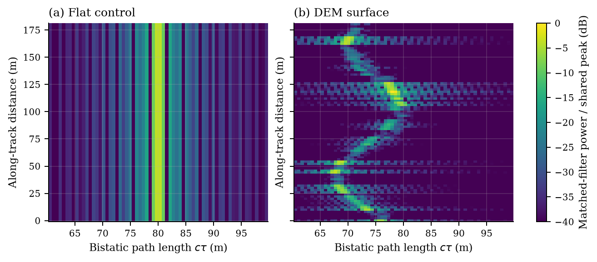
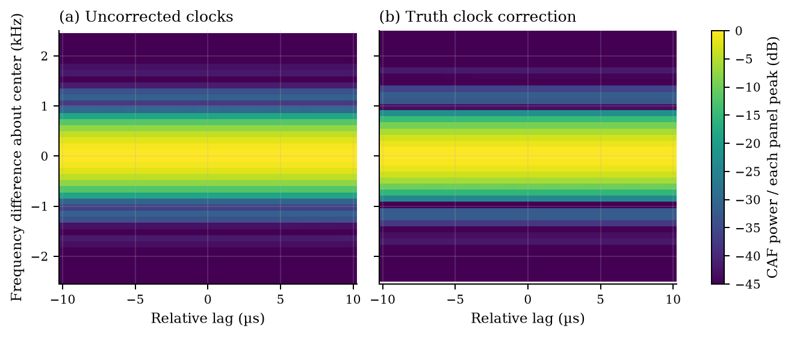

# RF sensing figures and interpretation

These figures analyze the recorded P100 datasets using conventions common in
radar, electronic support measures (ESM), and passive geolocation research.
They show sensor observables and estimator behavior, with explicit units,
normalization, observation length and processing assumptions. The underlying
propagation and I/Q were generated on the P100. The CAF FFTs also run on CUDA;
Welch analysis, clock interpolation and plotting use the host.

## Radar: matched-filter observables



**Figure 1.** Pulse-compressed power against total bistatic path length
`cτ = R_TX + R_RX` and along-track position, for the flat control and DEM.
Both panels use one shared peak-power reference and a −40 dB display floor.
Each of 91 positions supplies a 1,500-sample, 3 µs window at 500 MS/s; the
200 MHz, 2 µs LFM pulse is rectangular. This is a sequence of snapshot profiles,
not a coherent range–Doppler map. Paths evolve independently between snapshots.


**Figure 2.** Delay profiles at the hill, swale and second hill, using the same
traced channels with 200 MHz and 20 MHz pulses. Each site's two curves share a
reference. Nominal resolution in **total path length** is `c/B`: about 1.50 m
and 15.0 m respectively. Dividing by two would describe a different range
coordinate. Dotted lines are geometry references; they do not generate the I/Q.


**Figure 3.** I/Q-peak equivalent-height estimates versus the independent DEM
midpoint reference, and the empirical absolute-error CDF over 91 positions.
RMSE is 0.3507 m. Equivalent height assumes midpoint scattering and the recorded
2 m baseline; this is not general terrain inversion. Route samples are correlated,
so the CDF is descriptive and has no independent-trial confidence bounds.

## ESM: measured spectral observables


**Figure 4.** Final-capture PSD for both receivers: filtered analog I/Q, simulated
12-bit ADC output, and the numeric 8-bit control. Welch processing uses 1,024-sample
Hann segments, 512 overlap, 1,024 FFT bins and 2 MS/s nominal rate. Bin spacing is
1.953125 kHz; Hann equivalent noise bandwidth is 2.929688 kHz. PSD is in dBm/Hz
using the declared 50 Ω input reference. Vertical markers identify the known beacon
frequencies including clock offsets, excluding path Doppler. The model is uncalibrated;
the 8-bit curve does not represent a different physical SDR.


**Figure 5.** Weak beacon B's peak PSD within ±5 kHz of its known frequency,
divided by the median local PSD floor 15–60 kHz away. This is a bin-dependent
spectral prominence measurement, not total-band SNR or probability of detection.
The twelve 2.048 ms captures span 5.5 s with gaps; they are not a continuous record.
A blind detector, H0/H1 trial ensemble and threshold calibration would be needed
for a defensible ROC or `Pd` versus SNR plot.

## Passive geolocation: ambiguity and geometry



**Figure 6.** CAF between the two recorded receiver channels, before and after
oracle clock correction. Positive lag means receiver 2 arrives later; positive
frequency means its frequency is higher. The uncorrected panel is centered at
13.725 kHz, the nominal receiver-LO difference; the corrected panel is centered
at zero. Each panel is normalized to its own peak. These are interreceiver
ambiguity diagnostics, not target range–Doppler maps from reference/surveillance
antennas. Both channels contain the two beacon signals and terrain multipath.

The CAF uses a Hann-weighted 4,056-sample common interior of a 4,096-sample
capture, with energy normalization. The lag grid is 0.5 µs; the coherent
observation is 2.028 ms, giving a natural frequency scale of 493.10 Hz.
FFT padding displays a 122.07 Hz grid; it adds no observation time or bandwidth.
Oracle correction uses recorded receiver rates/LO errors and 32-tap Lanczos
interpolation. It is not an estimated synchronization procedure.


**Figure 7.** Delay cuts at the peak frequency and frequency cuts at the peak lag.
The broad delay ridge exposes the poor delay observability of these CW-dominated
recordings. A visual maximum alone does not establish a reliable TDOA estimate.


**Figure 8.** Loci computed from recorded epoch-zero poses and velocities for
beacon A: TDOA 188.23 ns and FDOA 10.45 Hz. Emitter altitude and velocity are held
at their recorded truth, and clocks are assumed calibrated. The emitter marker
is truth, not a recovered fix. These conditional geometric constraints explain
which measurements a geolocation estimator would need; they do not establish
an error ellipse, CRLB or localization accuracy from the current recordings.

## Literature informing the figure choices

- Satar et al., [Robust Weighted l₁,₂ Norm Filtering in Passive Radar Systems](https://doi.org/10.3390/s20113270), *Sensors*, 2020: CAF maps, Doppler cuts and detection/estimation performance figures. We adopt observable plots, not its filtering algorithm.
- Cohen and Eldar, [Sub-Nyquist Cyclostationary Detection for Cognitive Radio](https://arxiv.org/abs/1604.02659), 2016/2017: spectra, cyclic features and detection comparisons. Our CW data supports spectral diagnostics, not communication-modulation classification.
- Yeung and Gardner, [Search-Efficient Methods of Detection of Cyclostationary Signals](https://cyclostationarity.com/wp-content/uploads/2019/03/SEARCH-EFFICIENT-METHODS-OF-DETECTION-OF-CYCLOSTATIONARY-SIGNALS.pdf), *IEEE Transactions on Signal Processing*, 1996, Figures 6–8: ROC curves are tied to defined detection statistics and trial conditions.
- Guo et al., [Study on joint passive localization using TDOA and FDOA](https://doi.org/10.1177/1687814017737451), 2017: geometry and localization-error/GDOP analysis. We show geometry without inventing measurement covariance or a demonstrated fix.

## Reproduction and next measurements

```bash
# Inside the explicit P100 environment; existing recorded data is reused.
python scripts/basis_launch.py benchmarks/generate_sensing_figures.py --backend cuda
```

[Processed numerical products](figures/sensing_products.npz) and
[definitions, source hashes and processing parameters](figures/sensing_products.json)
are saved beside the figures; the processed CAF arrays retain the displayed frequency bands. `--backend numpy` permits CPU-only postprocessing
and validation, without changing the recorded P100 source data.

For additional standard research plots, collect a coherent pulse train with
persistent scatterer phase for range–Doppler processing; labeled signal-present/
signal-absent trials for ROC/CFAR evaluation; and synchronized broadband
multi-receiver captures with an explicit clock estimator and observation-noise
model for localization-error distributions, confidence ellipses and CRLB/GDOP
comparisons. Those would be new sensing experiments, beyond restyling this data.
