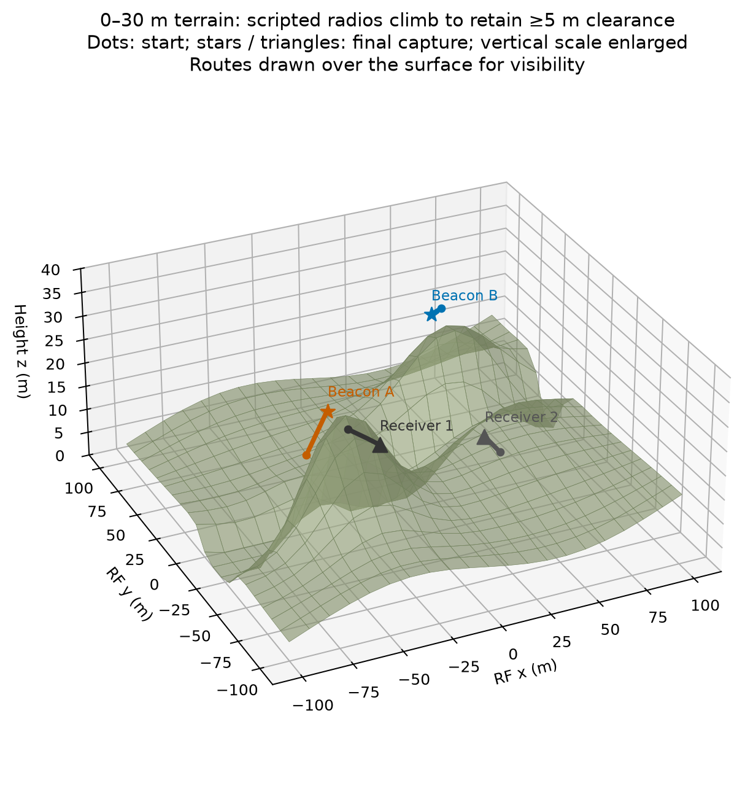
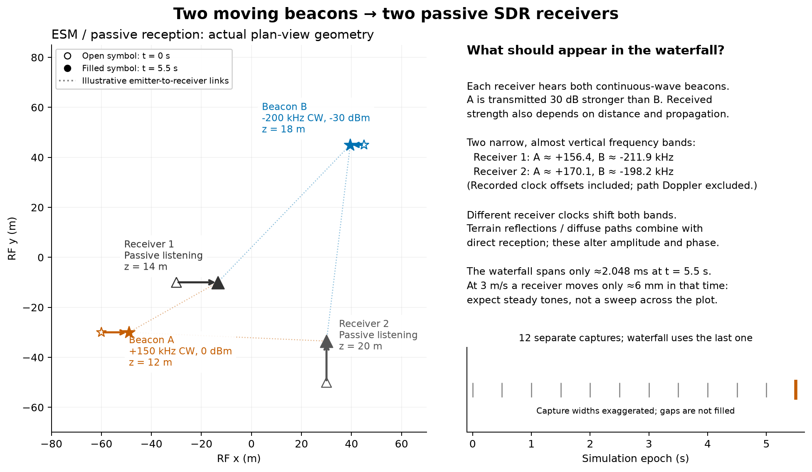
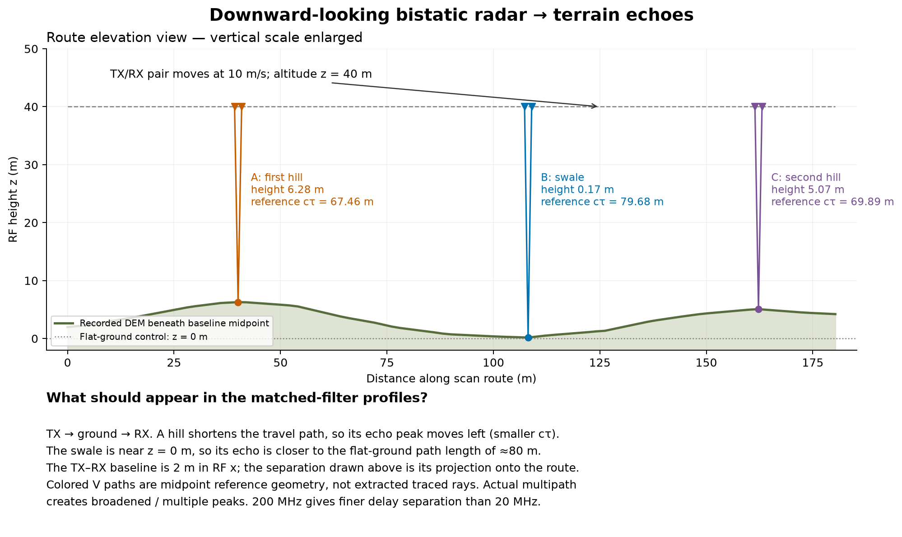
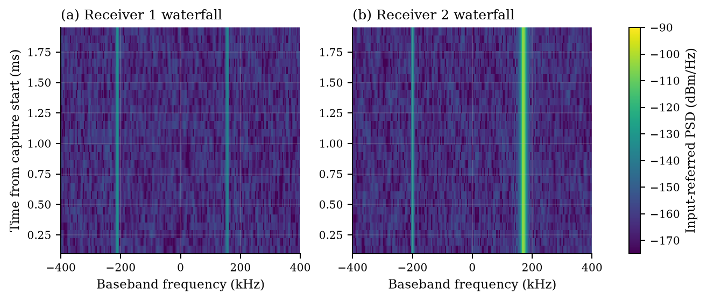
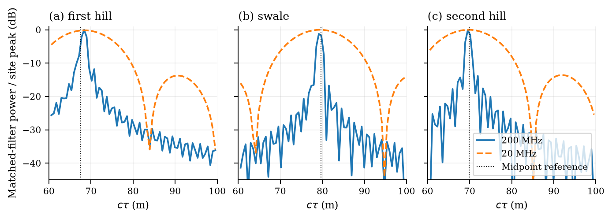
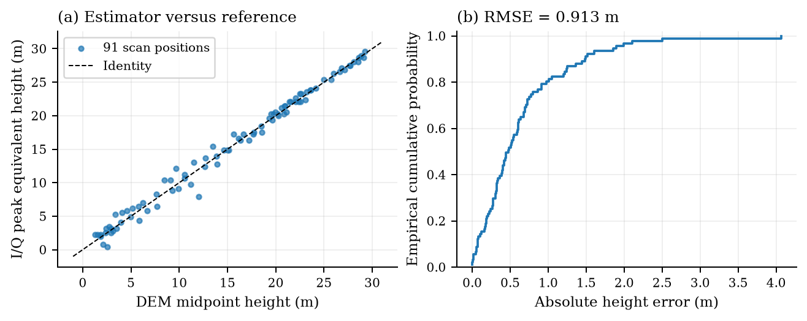
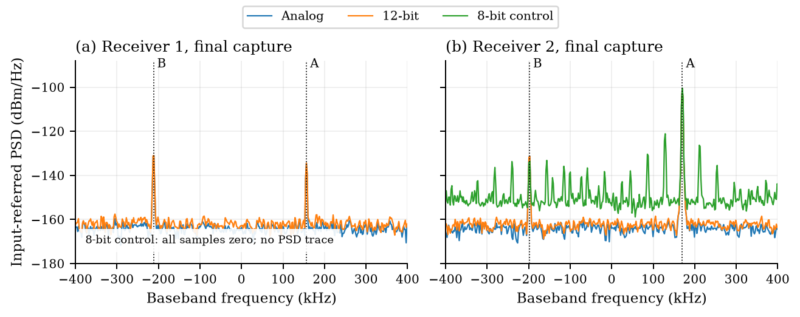
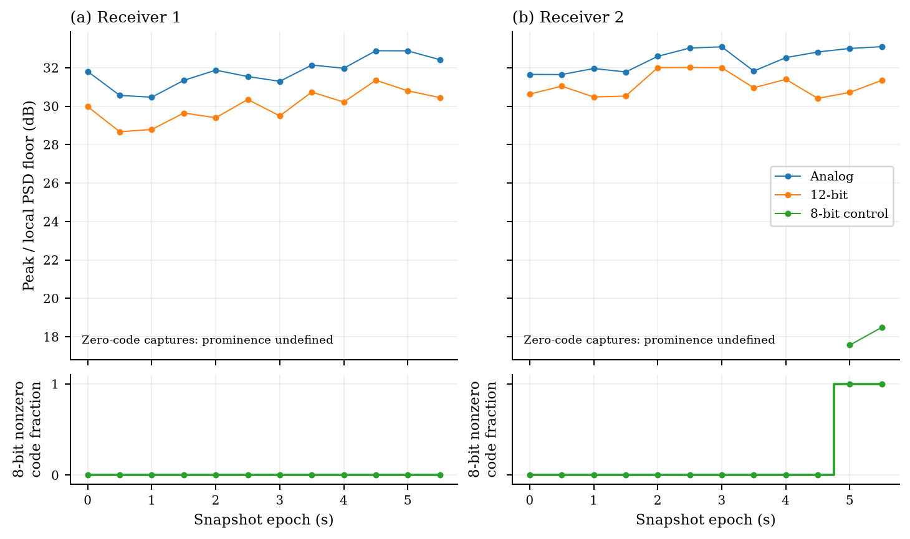
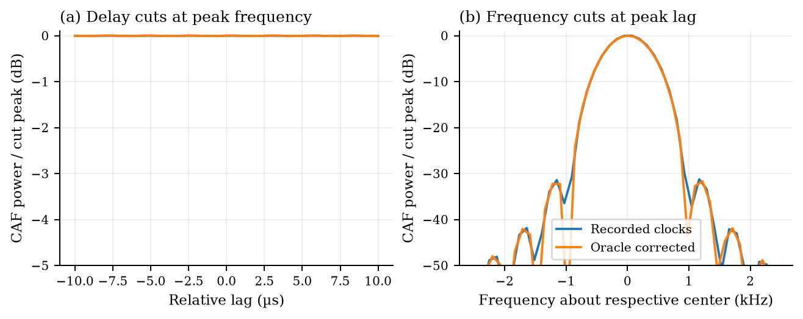
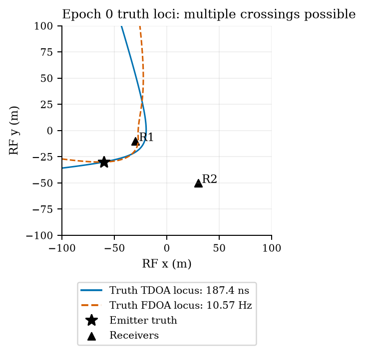

# RF sensing figures and interpretation

## Physical scenarios behind the figures

These are **two separate offline experiments**, not a single radar/ESM mission.
The diagrams below use the recorded simulation source data. They show RF Cartesian
coordinates and synthetic terrain, not a screenshot of a live AirSim flight.
[Diagram provenance and source hashes](figures/sensing_scenarios.json) are saved
with the figures.

The current mesh spans **0–30 m**, including zero-height patches. The ESM
radios climb where needed to maintain at least 5 m clearance; vertical velocity
follows the local terrain slope. This is a scripted trajectory, not autopilot
dynamics. Per-capture poses and clearances are recorded in the source report.





**ESM / passive reception.** Open symbols mark the starting positions; filled
symbols mark the final capture at 5.5 s. Arrows show the intervening motion.
Heights are labeled because the overhead view hides the vertical coordinate.
Beacon A transmits a +150 kHz baseband CW tone at 0 dBm; B transmits a −200 kHz
tone at −30 dBm, around a nominal 915 MHz carrier. Both receivers listen to both
beacons over synthetic terrain, with direct, reflected and diffuse propagation.
Dotted connecting lines show which devices communicate, not extracted traced rays.

The waterfall should therefore contain two nearly vertical bands, with strength
depending on visibility and propagation. Clock errors shift their apparent frequencies differently
at the two receivers. During the approximately 2.048 ms displayed capture, a
receiver moves only about 6 mm horizontally; the full 5.5 s motion is not displayed
in that waterfall. The weak-line plot instead compares twelve separate captures
along those routes. The passive delay/frequency cuts compare the two receivers'
recordings; the narrowband tones provide poor delay discrimination.

[Mesh visibility checks](figures/sensing_visibility.json) show that the
final capture's **Beacon A → Receiver 1 direct path is blocked by terrain**;
the other three direct links are clear. The blocked beacon can still arrive
through reflected or diffuse paths. This explains why its received band is
much weaker at Receiver 1, despite A's higher transmit power. The plan-view
diagram marks the blocked direct link with a red cross.



**Terrain radar.** A downward-looking TX/RX pair moves at 10 m/s at RF height
40 m (at least 10 m above the tallest terrain), with a 2 m baseline in RF x. The elevation view uses the actual DEM
midpoint samples along the route. Its vertical scale is enlarged; the baseline
separation shown is projected onto the route. Colored V paths are illustrative
midpoint references, not the actual traced multipath. The selected first hill,
swale and second hill are the same sites used in the matched-filter profiles.

Raised ground shortens the TX–ground–RX path: the hills' peaks move toward
smaller total path length `cτ`, while the swale lies near the approximately
80 m flat-ground reference. Multiple scattering paths broaden or split the
response. Comparing 200 MHz with 20 MHz on the same traced channels shows the
effect of bandwidth on delay separation. The height-error plot then compares
the I/Q peak's equivalent height with the DEM midpoint reference along the route.

## What the color plots mean

A **spectrum waterfall** has frequency on one axis, acquisition time on the
other, and spectral power or power density represented by color. It is a stack
of spectra from successive time windows of received I/Q. See
[Rohde & Schwarz's spectrogram definition](https://www.rohde-schwarz.com/lat/knowledge-center/videos/how-to-visualize-signals-with-a-spectrogram-on-the-fswx_251220-1613784.html).

A conventional pulsed **range–Doppler map** displays response power against range
and Doppler frequency (or appropriately converted radial velocity). Range
processing operates in fast time within pulses; Doppler processing operates
across consecutive pulses in slow time. PRF, pulse count and coherent observation
length must be specified. See [MathWorks' range–Doppler processing](https://www.mathworks.com/help/phased/ug/range-doppler-response.html).

The current full-color figure is a genuine **frequency–time waterfall**.
The prior range-versus-position and interreceiver CAF color surfaces have been
removed from the displayed/generated set. Their scalar data and one-dimensional
profiles remain useful diagnostics; they are not labeled as spectrum waterfalls
or conventional target range–Doppler maps.

## ESM waterfall from a contiguous received capture



**Figure 1.** Each panel uses one receiver's final contiguous 4,096-sample
12-bit ADC I/Q block, starting at simulation epoch 5.5 s. It shows approximately
2.048 ms of recorded signal, not the entire 5.5 s trajectory. A 512-sample Hann
window and 128-sample hop produce 29 spectra; each row is dated at its window
center. Newest time is at the top. No disjoint snapshots are joined or filled.

The actual receiver sample rates are 2,000,010 and 1,999,980 samples/s. Frequency
bins are approximately 3.906 kHz apart; Hann equivalent noise bandwidth is about
5.859 kHz. Colors show input-referred **PSD in dBm/Hz**, using the 50 Ω model,
with one shared scale for both receivers. The two stationary bands are the
recorded beacons; the waterfall does not imply frequency hopping. The waterfall is computed from recorded received I/Q using a short-time Fourier
transform. The receiver remains a specification-based, uncalibrated model.

## Radar profiles and estimation error



**Figure 2.** Matched-filter profiles at the hill, swale and second hill, using
the same traced channels with 200 MHz and 20 MHz rectangular LFM pulses.
The horizontal coordinate is total bistatic path length `cτ = R_TX + R_RX`.
Each site's two curves share a power reference. Nominal total-path-length
resolution is `c/B`: about 1.50 m and 15.0 m. Dotted lines are independent
midpoint-geometry references; they do not generate the I/Q.



**Figure 3.** I/Q-peak equivalent-height estimates versus the DEM midpoint
reference, and the absolute-error CDF over 91 scan positions. RMSE is 0.9130 m.
Equivalent height assumes midpoint scattering and the recorded 2 m baseline.
The route samples are correlated; this is a descriptive empirical CDF without
independent-trial confidence bounds, not general terrain inversion.

**No range–Doppler map is claimed from these snapshots.** The radar data consists
of short receive windows at separated route epochs, not a qualified coherent
pulse train with persistent scatterer phase. Relabeling an along-track or height
axis as Doppler, or Fourier transforming those independently generated snapshots,
would not fix that missing measurement.

## ESM spectra and weak-line measurements



**Figure 4.** Final-capture PSD: filtered analog I/Q, simulated 12-bit ADC output,
and the numeric 8-bit control. Welch processing uses 1,024-sample Hann segments,
512 overlap, 1,024 FFT bins and 2 MS/s nominal rate. Bin spacing is 1.953125 kHz;
Hann equivalent noise bandwidth is 2.929688 kHz. PSD is in dBm/Hz at the declared
50 Ω input. Markers indicate known beacon frequencies with clock offsets,
excluding path Doppler. The 8-bit control is not a different physical SDR.



**Figure 5.** Weak beacon B's maximum PSD within ±5 kHz of its known frequency,
divided by the median local PSD floor 15–60 kHz away. This is spectral prominence,
not total-band SNR or detection probability. Twelve 2.048 ms captures span 5.5 s
with gaps; this line plot reports those separate measurements. Labeled H0/H1
trials and threshold calibration would be needed for a defensible ROC.

## Passive-geolocation diagnostics as line plots



**Figure 6.** CAF delay cuts at peak frequency and frequency cuts at peak lag,
for the two recorded receiver channels. Positive lag means receiver 2 arrives
later; positive frequency means it is higher in frequency. Raw-clock frequency
cuts are centered at the nominal 13.725 kHz receiver-LO difference; the oracle
corrected cuts are centered at zero. Each cut uses its own peak reference.

The CAF uses a Hann-weighted 4,056-sample common interior: 2.028 ms of nominal
observation, with a natural frequency scale of 493.10 Hz and 0.5 µs lag grid.
FFT padding gives a 122.07 Hz display grid, not increased physical resolution.
Oracle correction uses recorded sample rates, LO errors and 32-tap Lanczos
interpolation; it is not an estimated synchronization procedure. The broad delay
ridge does not establish a reliable TDOA estimate. These are interreceiver
ambiguity diagnostics, not target range–Doppler responses.



**Figure 7.** Loci from recorded epoch-zero poses/velocities for beacon A:
TDOA 187.43 ns and FDOA 10.57 Hz. Emitter height and velocity are held at truth,
and clocks are assumed calibrated. The emitter marker is truth, not an estimated
fix. No localization accuracy, error ellipse or CRLB is demonstrated here.

## Literature and reproduction

The observable profiles and performance diagnostics were informed by
[Satar et al.'s passive-radar study](https://doi.org/10.3390/s20113270),
[Cohen and Eldar's spectrum-sensing study](https://arxiv.org/abs/1604.02659),
[Yeung and Gardner's detection ROC study](https://cyclostationarity.com/wp-content/uploads/2019/03/SEARCH-EFFICIENT-METHODS-OF-DETECTION-OF-CYCLOSTATIONARY-SIGNALS.pdf),
and [Guo et al.'s TDOA/FDOA geometry study](https://doi.org/10.1177/1687814017737451).
Their algorithms and demonstrated capabilities are not claimed for this data.

```bash
python benchmarks/generate_sensing_figures.py
python benchmarks/generate_sensing_scenarios.py
```

[Processed numerical products](figures/sensing_products.npz) and
[window definitions, source hashes and processing parameters](figures/sensing_products.json)
are saved beside the figures. The plotting commands use the recorded source
data and preserve the stated processing definitions. A genuine radar range–Doppler figure requires a new
coherent acquisition with its pulse timing, phase model, CPI and Doppler ambiguity
limits recorded explicitly.

## Power, clearance and terrain blockage

At the final capture (5.5 s), Beacon A → Receiver 1 is terrain-blocked. Its
recorded link power is −99.78 dBm, versus −65.89 dBm at Receiver 2. Beacon B's
powers are −95.00 and −95.50 dBm respectively. These are per-link powers before
receiver noise, not integrated powers read from the PSD plot. The records and
[mesh visibility report](figures/sensing_visibility.json) identify each capture.
