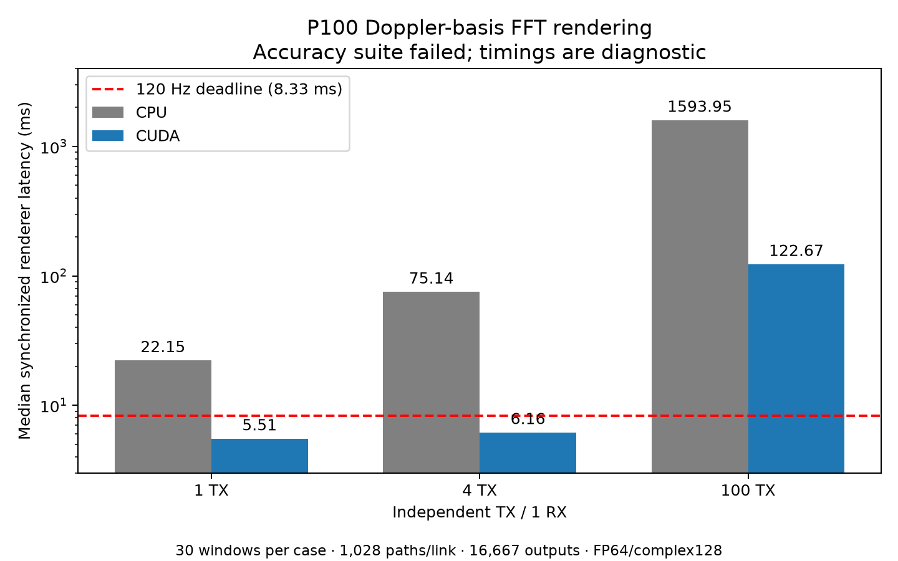

# Doppler-basis renderer profiling: p100-basis-full-20261004

**Timing scope:** Renderer-call wall service or separately labeled projection/kernel-call experiment; excludes propagation and receiver processing. [Common measurement definitions](../../../TIMING_CONVENTIONS.md) apply to units, statistics, cache state, ratios and comparisons. Historical measurements and estimates are not current fleet-update qualification.

<!-- BEGIN SIGNAL TIME CONTEXT -->

**Simulation-time reference:** wall seconds per simulated signal second = total measured wall service / total output signal duration per receiver. Receiver durations are concurrent, not added across receivers. This is a processing-cost ratio for the named scope; it is not a whole-flight measurement. Instrumented costs are diagnostic.

| Raw case / timed scope | Mode | Calls | Signal ms/call (mean) | Measured signal seconds | Measured wall seconds | Wall seconds / signal second |
| --- | --- | ---: | ---: | ---: | ---: | ---: |
| [results/profiling/p100-basis-full-20261004/profiles/basis_cpu_100tx_1rx.json](profiles/basis_cpu_100tx_1rx.json) — Renderer call | unprofiled_basis_benchmark | 30 | 8.333500 | 0.250005 | 47.930034 | 191.716 |
| [results/profiling/p100-basis-full-20261004/profiles/basis_cpu_1tx_1rx.json](profiles/basis_cpu_1tx_1rx.json) — Renderer call | unprofiled_basis_benchmark | 30 | 8.333500 | 0.250005 | 0.667671 | 2.671 |
| [results/profiling/p100-basis-full-20261004/profiles/basis_cpu_4tx_1rx.json](profiles/basis_cpu_4tx_1rx.json) — Renderer call | unprofiled_basis_benchmark | 30 | 8.333500 | 0.250005 | 2.287211 | 9.149 |
| [results/profiling/p100-basis-full-20261004/profiles/basis_cuda_100tx_1rx.json](profiles/basis_cuda_100tx_1rx.json) — Renderer call | unprofiled_basis_benchmark | 30 | 8.333500 | 0.250005 | 3.691511 | 14.766 |
| [results/profiling/p100-basis-full-20261004/profiles/basis_cuda_1tx_1rx.json](profiles/basis_cuda_1tx_1rx.json) — Renderer call | unprofiled_basis_benchmark | 30 | 8.333500 | 0.250005 | 0.166860 | 0.667 |
| [results/profiling/p100-basis-full-20261004/profiles/basis_cuda_4tx_1rx.json](profiles/basis_cuda_4tx_1rx.json) — Renderer call | unprofiled_basis_benchmark | 30 | 8.333500 | 0.250005 | 0.186514 | 0.746 |

The measured signal seconds column totals processed windows. Synthetic and historical short-capture jobs may reuse epochs or leave gaps; this total does not assert a continuous simulation timeline. First-use/warmup are excluded where the recorded harness excludes them. Stage milliseconds elsewhere use the same signal duration as their parent call; stage median / signal-ms is a median cost ratio, while the final column above uses sums (equivalently mean costs for fixed-duration calls).

<!-- END SIGNAL TIME CONTEXT -->


Status: **FAILED / INCOMPLETE**.

**Qualification failure:** the required device suite returned six passes and one failure for split captures at Unix-scale timestamps. Table PASS values refer only to capture-level checks, not overall qualification. These timings are diagnostic. See [findings](FINDINGS.md).



Renderer GPU status: `verified_cuda_cupy`. Source: `b4d48f5e432b5610eb3fedfa854bf9d5347cd2cb`; dirty: `false`.

**Renderer-only:** synthetic changing channels, equal sample clocks, FP64/complex128, private source data and FFTs. All configured paths are valid. No ray tracing, source generation, clock resampling, noise/filter/ADC, AirSim or network/queueing is included.

Propagation: excluded; current pinned Dr.Jit does not support P100; legacy results retained separately. A successful renderer run does not establish current Sionna compatibility or complete RF service at 120 Hz.

## Unprofiled renderer-call wall service and serial throughput

| Backend | TX × RX | Valid paths/link | Samples | Median | p95 | p99 | Max | Windows/s | Misses 120 Hz | Accuracy |
|---|---:|---:|---:|---:|---:|---:|---:|---:|---:|---|
| [cpu](profiles/basis_cpu_100tx_1rx.json) | 100 × 1 | 1028 | 16667 | 1593.948 ms | 1622.187 ms | 1664.430 ms | 1680.257 ms | 0.626 | 30/30 | PASS |
| [cpu](profiles/basis_cpu_1tx_1rx.json) | 1 × 1 | 1028 | 16667 | 22.149 ms | 23.142 ms | 23.303 ms | 23.330 ms | 44.932 | 30/30 | PASS |
| [cpu](profiles/basis_cpu_4tx_1rx.json) | 4 × 1 | 1028 | 16667 | 75.140 ms | 81.476 ms | 82.490 ms | 82.639 ms | 13.116 | 30/30 | PASS |
| [cuda](profiles/basis_cuda_100tx_1rx.json) | 100 × 1 | 1028 | 16667 | 122.671 ms | 124.461 ms | 125.186 ms | 125.431 ms | 8.127 | 30/30 | PASS |
| [cuda](profiles/basis_cuda_1tx_1rx.json) | 1 × 1 | 1028 | 16667 | 5.510 ms | 5.958 ms | 6.167 ms | 6.244 ms | 179.792 | 0/30 | PASS |
| [cuda](profiles/basis_cuda_4tx_1rx.json) | 4 × 1 | 1028 | 16667 | 6.157 ms | 6.852 ms | 6.948 ms | 6.974 ms | 160.846 | 0/30 | PASS |

Timing includes fresh path-dependent setup, host validation/packing, private input uploads, GPU coefficient construction/projection, private FFTs, receiver summation and synchronized final output export. First-use/JIT time is recorded separately. Instrumented Nsight runs are excluded from this table.

The scene deadline is 8.333 ms. Default windows contain 16,667 samples at 2 MS/s (8.3335 ms of signal). Live input accumulation, interpolation lookahead and transport add delivery latency. This API exports a complete window; it is not yet a persistent continuous streaming receiver.

## Paired CPU/GPU renderer measurements

* 100 TX × 1 RX: observed CPU/CUDA median ratio **12.99×**; CUDA output rate **135449 samples/s per receiver**; remaining mean-latency factor to 120 Hz **14.77×**.
* 1 TX × 1 RX: observed CPU/CUDA median ratio **4.02×**; CUDA output rate **2996591 samples/s per receiver**; remaining mean-latency factor to 120 Hz **1.00×**.
* 4 TX × 1 RX: observed CPU/CUDA median ratio **12.20×**; CUDA output rate **2680816 samples/s per receiver**; remaining mean-latency factor to 120 Hz **1.00×**.

## Separate GPU stage spans and memory

One extra instrumented capture supplies CUDA-event spans and NVTX ranges. Event spans can include host submission/idle gaps, especially packing; they are not pure kernel execution times. Do not add these spans to wall latency. Use Nsight kernel/API statistics for execution-level attribution.

* [basis_cuda_100tx_1rx.json](profiles/basis_cuda_100tx_1rx.json), receiver 0: stage spans {'basis.host_pack_and_upload': 7.644351989030838, 'basis.delay_map': 19.882399797439575, 'basis.temporal_coefficients': 13.573696002364159, 'basis.path_projection': 64.73871977627277, 'basis.private_fft_filters': 23.446911998093128, 'basis.reconstruction_and_sum': 3.6337279994040728, 'basis.final_output_export': 0.08796799927949905}. Pool used/reserved 9242112/86593536 bytes; largest sampled pool-use checkpoint 26187776 bytes. Allocator snapshots include plans/cache and are not exact process peak VRAM.
* [basis_cuda_1tx_1rx.json](profiles/basis_cuda_1tx_1rx.json), receiver 0: stage spans {'basis.host_pack_and_upload': 0.47574400901794434, 'basis.delay_map': 1.9210560321807861, 'basis.temporal_coefficients': 2.330047994852066, 'basis.path_projection': 1.2284480035305023, 'basis.private_fft_filters': 0.7592319995164871, 'basis.reconstruction_and_sum': 0.5617600027471781, 'basis.final_output_export': 0.156031996011734}. Pool used/reserved 2446336/9287680 bytes; largest sampled pool-use checkpoint 3502080 bytes. Allocator snapshots include plans/cache and are not exact process peak VRAM.
* [basis_cuda_4tx_1rx.json](profiles/basis_cuda_4tx_1rx.json), receiver 0: stage spans {'basis.host_pack_and_upload': 1.2161920070648193, 'basis.delay_map': 1.6083840131759644, 'basis.temporal_coefficients': 1.3345920201390982, 'basis.path_projection': 2.2370240092277527, 'basis.private_fft_filters': 1.0149120017886162, 'basis.reconstruction_and_sum': 0.2674880027770996, 'basis.final_output_export': 0.1801919937133789}. Pool used/reserved 8990208/36327424 bytes; largest sampled pool-use checkpoint 13215744 bytes. Allocator snapshots include plans/cache and are not exact process peak VRAM.

## Accuracy and hardware

Every benchmark compares all receiver output samples against CPU basis reconstruction, checks all paths of all links in initial/final sample prefixes against direct rendering, and checks complete direct output for the first/last transmitter of each receiver. Tests cover cancellation, changed channels, split captures, finite boundaries and Unix timestamps. Error is relative to the finite interpolation operator; ideal-sinc/noise-floor qualification remains separate.

CPU quota: `max 100000`. Hardware, pinned packages and source hashes: [environment.json](environment.json) and [installed_packages.json](installed_packages.json).

```text
index, uuid, name, driver_version, memory.total [MiB], compute_cap
0, GPU-0d70be84-560c-cf1e-8d49-c41015f45415, Tesla P100-PCIE-16GB, 580.178.04, 16384 MiB, 6.0
```

One-second nvidia-smi samples; includes other processes and may miss peaks. Not allocated-byte or guaranteed peak VRAM measurement.

{
  "GPU-0d70be84-560c-cf1e-8d49-c41015f45415": {
    "samples": 86,
    "index": "0",
    "max_sampled_memory_mib": 625.0,
    "max_sampled_utilization_percent": 88.0,
    "max_sampled_power_w": 108.56,
    "max_sampled_temperature_c": 46.0
  }
}

## Task outcomes

| Task | Status | Required | Log |
|---|---|---|---|
| basis_cuda_preflight | ok | True | [log](logs/basis_cuda_preflight.log) |
| basis_cuda_correctness | failed | True | [log](logs/basis_cuda_correctness.log) |
| basis_cpu_1tx_1rx | ok | True | [log](logs/basis_cpu_1tx_1rx.log) |
| basis_cuda_1tx_1rx | ok | True | [log](logs/basis_cuda_1tx_1rx.log) |
| basis_cpu_4tx_1rx | ok | True | [log](logs/basis_cpu_4tx_1rx.log) |
| basis_cuda_4tx_1rx | ok | True | [log](logs/basis_cuda_4tx_1rx.log) |
| basis_cpu_100tx_1rx | ok | True | [log](logs/basis_cpu_100tx_1rx.log) |
| basis_cuda_100tx_1rx | ok | True | [log](logs/basis_cuda_100tx_1rx.log) |
| nsys_basis_cuda_100tx_1rx | unavailable | False | Nsight absent; separate CUDA-event stage spans still collected |

One P100 normally tests one receiver with 100 private TX inputs. `--rx 10` measures ten receivers sequentially on this GPU; it is not a ten-GPU fleet measurement. A renderer meeting the deadline still leaves propagation and mandatory receiver processing to qualify.

Large Nsight traces remain in ignored raw/. Small reports/JSON/logs can be published with scripts/publish_gpu_results.py.
