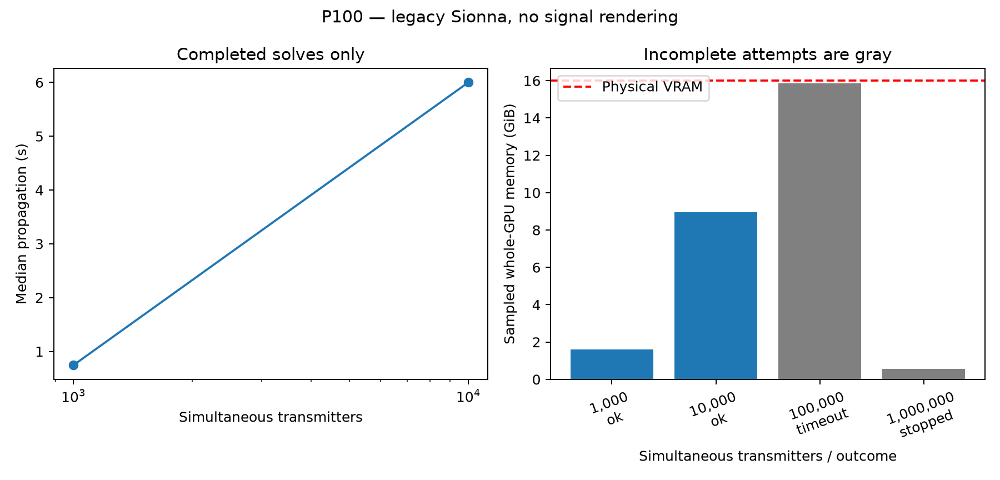

# P100 legacy propagation-only scaling

**Timing scope:** Legacy propagation-only scaling; rendering disabled; failed sizes have no throughput. [Common measurement definitions](../../../TIMING_CONVENTIONS.md) apply to units, statistics, cache state, ratios and comparisons. Historical measurements and estimates are not current fleet-update qualification.

<!-- BEGIN SIGNAL TIME CONTEXT -->

**Simulation-time reference:** use **wall seconds per simulated signal second**, not an unlabeled whole-run time. For fixed windows, divide mean service milliseconds by samples/sample-rate × 1,000. Stage costs use their parent window denominator. Geometry-only solves and analytic operation counts have no generated signal duration; a signal-time ratio is **not applicable**, unless an explicit update interval is assumed and labeled as a scheduling estimate. Unrecorded flight costs remain unknown. See [recorded normalized cases](../../../SIGNAL_TIME_RESULTS.md).

<!-- END SIGNAL TIME CONTEXT -->

**Legacy Sionna 0.19.2 / Mitsuba 3.5.2 / Dr.Jit 0.4.6 / TensorFlow 2.15.1.**

All transmitters in each case are instantiated simultaneously in one scene and one native solve; no transmitter batching. One RX, static TX positions, original terrain mesh, 915 MHz, synthetic single-element dipoles, depth 1, LoS/reflection/scattering. Native Fibonacci tracing launches 1,028 rays per TX; scattering keep probability 1, random scatter phases disabled. Material epsilon_r=5, conductivity=.01, scattering=.3; legacy material lacks thickness.

Signal rendering, I/Q synthesis, receiver filtering/noise/ADC and full coefficient export are omitted. Timings include native trace, RF fields, host orchestration and synchronized scalar reductions. Scene setup and first solve are excluded from steady timings and retained separately. These are experimental legacy measurements, not the branch custom solver or numerically validated equivalents.

| Simultaneous TX | Rays requested | Outcome | Timed median | Trace / fields medians | Sampled GPU memory max | Sampled GPU busy max |
|---:|---:|---|---:|---:|---:|---:|
| 1,000 | 1,028,000 | ok (complete) | 0.743 s | 0.468 / 0.279 s | 1.595 GiB | 100.0% |
| 10,000 | 10,280,000 | ok (complete) | 5.999 s | 3.415 / 2.584 s | 8.942 GiB | 100.0% |
| 100,000 | 102,800,000 | timeout (first_solve) | — | — | 15.866 GiB | 100.0% |
| 1,000,000 | 1,028,000,000 | stopped_by_user (first_solve) | — | — | 0.554 GiB | 100.0% |

## Capacity and failed attempts

- **100,000 TX:** timeout during `first_solve`, after 370.5 s; 100000 TX objects created. Container host OOM kill: `False`. See [checkpoint](metrics/100000tx.json) and [log](logs/100000tx.log).
- **1,000,000 TX:** stopped_by_user during `first_solve`, after 210.1 s; 1000000 TX objects created. Container host OOM kill: `False`. See [checkpoint](metrics/1000000tx.json) and [log](logs/1000000tx.log).

User requested no further scaling after 100k reached memory pressure; stopped 1M during first solve after all TX objects were instantiated. Not an observed 1M allocation failure.

## Interpretation and limits

At successful scales, both Dr.Jit CUDA/OptiX events and TensorFlow GPU allocation are recorded. GPU busy samples reach 100%; earlier zero samples cannot establish that 99% of processing capacity was unused. Busy percentage measures activity over a sampling window, not theoretical compute throughput.

The runner exposes all 16 GiB of P100 VRAM. Its 12 GiB container cap applies only to host RAM; host swap is disabled. Larger cases have bounded wall-clock budgets and fail independently. Memory-pressure warnings or timeouts do not establish an exact maximum supported TX count; intermediate sizes, ray budget, material/scattering, path representation, receiver count and implementation all affect capacity. No GPU reset or driver reconfiguration is performed.

GPU telemetry samples every 100 ms and includes other processes (about 263 MiB baseline). Sampled maxima can miss transient peaks. TensorFlow allocator peaks omit Dr.Jit and other allocators. Dr.Jit histories omit TensorFlow CUDA kernels and are not end-to-end critical-path timing.

Sample streams are retained as compressed CSV in `telemetry/`. Environment metadata identifies the measured base source commit; `harness_checksums.json` identifies the committed benchmark/launcher source. The 1M attempt was stopped at the user’s request once the 100k memory boundary was evident; it is not a measured 1M OOM failure.

1k uses 3 warmups and 10 timed epochs; 10k uses 1 warmup and 3 timed epochs. Few-epoch p95 values are smoke statistics, not reliable latency tails. Static geometry and repeated seeds do not represent a dynamic million-device deployment. Scientific equivalence and signal quality have not been validated.

The earlier full service collection measured approximately 96% host I/Q/receiver time at 100 TX. Removing that stage exposes propagation scaling, but does not make simultaneous propagation unlimited. These results support investigating signal rendering and propagation memory independently. No extrapolated latency is assigned to failed cases.

[Manifest](manifest.json) · [Summary](summary.json) · [Environment](environment.json) · [Harness](../../../scripts/p100_legacy/README.md) · [Checksums](checksums.json)
